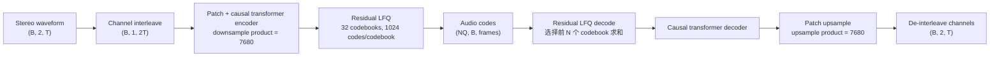
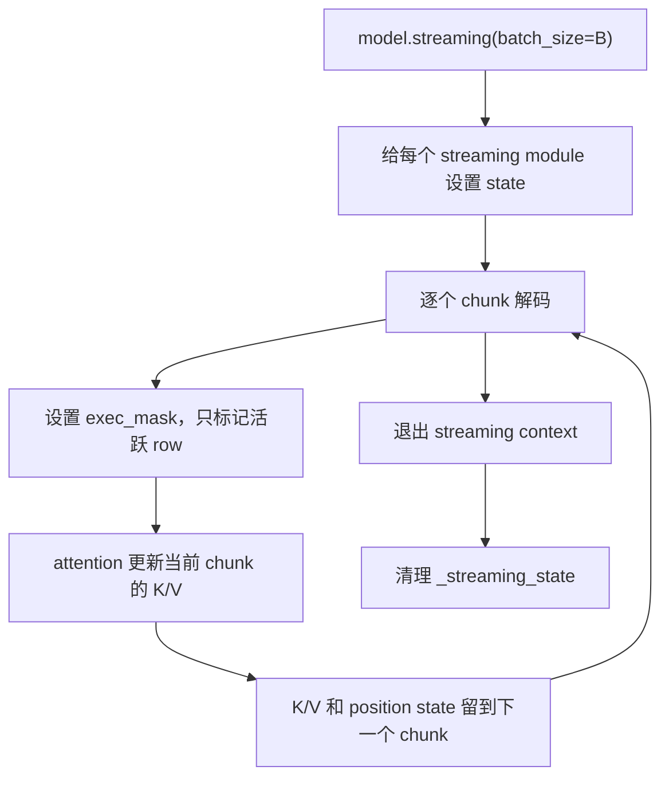
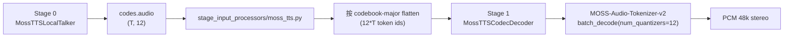

# MOSS Audio Tokenizer v2 代码讲解与 vllm-omni Port 审计

本文结合本地 `MOSS-Audio-Tokenizer` 目录、HF 缓存中的
`MOSS-Audio-Tokenizer-v2` remote code，以及 vllm-omni 中 MOSS-TTS 的 port
代码，解释 MOSS Audio Tokenizer v2 的结构、关键代码路径、流式机制，以及当前
vllm-omni 接入里值得修正的问题。

检查过的代码来源：

- 官方本地仓库：`/root/vllm-omni-workspace/MOSS-Audio-Tokenizer`
- HF 缓存的 v2 remote code：
  `/mnt/data1/huggingface/modules/transformers_modules/OpenMOSS_hyphen_Team/MOSS_hyphen_Audio_hyphen_Tokenizer_hyphen_v2/f6e20e543b33d2c252a7ef71bdf8aa71e5ff9169/`
- vllm-omni port：
  `vllm_omni/model_executor/models/moss_tts/audio_tokenizer.py`
  `vllm_omni/model_executor/models/moss_tts/modeling_moss_tts_codec.py`
  `vllm_omni/model_executor/stage_input_processors/moss_tts.py`

## 结论摘要

MOSS Audio Tokenizer v2 是一个 causal transformer audio codec。它的公开输入和
输出是 48 kHz stereo waveform；内部会先把左右声道交错成单通道长序列，再经过
patch downsample、causal transformer encoder、Residual LFQ quantizer。解码时则从
codebook ids 反向经过 LFQ decode、causal transformer decoder、patch upsample，最后
还原成 stereo waveform。

v2 的关键配置是：

- `sampling_rate = 48000`
- `downsample_rate = 3840`
- `number_channels = 2`
- `enable_channel_interleave = true`
- `quantizer_type = rlfq`
- `num_quantizers = 32`
- `codebook_size = 1024`
- public codec frame rate 是 `48000 / 3840 = 12.5 fps`
- 一个 public codec frame 对应每个声道 `3840` 个 sample，也就是 80 ms

MOSS-TTS-Local-v1.5 并不使用 codec 的全部 32 个 quantizer。Local talker 每帧只生成
`n_vq = 12` 个 codebook，stage 1 decode 时通过 `num_quantizers=12` 只解码前 12 个
quantizer。

## 整体结构



对 48 kHz stereo waveform，如果每个声道长度是 `T`：

```text
public input length:       T
internal interleaved len:  2T
encoder patch product:     7680
code frames:               2T / 7680 = T / 3840
public frame rate:         48000 / 3840 = 12.5 fps
```

这里容易混淆的是 `downsample_rate=3840` 的语义。它是 public waveform 接口上的
rate，也就是一个 code frame 对应每个声道 3840 个 sample；内部交错后长度变成
`2T`，所以 encoder patch product 是 7680，仍然对应 public 侧的 3840 samples/channel。

## v2 Config 逐段讲解

本地 clone 下来的 `MOSS-Audio-Tokenizer/config.json` 不是 v2 配置，它是 24 kHz mono
的 v1 风格配置。MOSS-TTS-Local-v1.5 实际使用的是
`OpenMOSS-Team/MOSS-Audio-Tokenizer-v2`，也就是 HF cache 里的 v2 `config.json`。

```text
config.json:1-8
```

这一段声明模型结构和 remote code 映射：

- `architectures=["MossAudioTokenizerModel"]`
- `auto_map.AutoConfig`
- `auto_map.AutoModel`

因此通过：

```python
AutoModel.from_pretrained(..., trust_remote_code=True)
```

加载时，Transformers 会使用官方 remote code 中的 `MossAudioTokenizerModel`，而不是
vllm-omni vendored fallback。

```text
config.json:9-18
```

这一段定义 v2 的 public codec mode：

- `model_type="moss-audio-tokenizer"`
- `sample_rate/sampling_rate=48000`
- `downsample_rate=3840`
- `number_channels=2`
- `enable_channel_interleave=true`
- `attention_implementation="flash_attention_2"`
- `compute_dtype="bf16"`

这里的 `sampling_rate` 和 `number_channels` 决定 public waveform 是 48 kHz stereo。
`enable_channel_interleave=true` 决定内部不是把两个声道分别编码，而是把左右声道 sample
交错成一个时间序列。

```text
configuration_moss_audio_tokenizer.py:105-146
```

`MossAudioTokenizerConfig.__init__` 负责保存 public audio 参数，并兼容旧字段名：

- `channels_numbers` 可以映射成 `number_channels`
- `attention_backend` 可以映射成 `attention_implementation`
- `codec_compute_dtype` 可以映射成 `compute_dtype`
- `codec_load_dtype` 可以映射成 `codec_weight_dtype`

这段对 serving 很重要，因为 v2 的 transformer compute 可以用 bf16，而 quantizer 相关
数值路径可以保持 fp32。

```text
configuration_moss_audio_tokenizer.py:147 onward
```

后面的 encoder/decoder kwargs 是默认值，但 v2 checkpoint 会在 config 里覆盖这些
模块列表。实际 v2 使用显式的 `encoder_kwargs` 和 `decoder_kwargs`，里面包含每个
transformer block 的 `context_duration`。这些 context 参数会决定 causal attention 的
可见历史窗口。

## 官方 Model 逐段讲解

### 输出类型

```text
modeling_moss_audio_tokenizer.py:41-90
```

这里定义三个 dataclass 风格的输出容器：

- `MossAudioTokenizerEncoderOutput`：保存 codes、code lengths、可选 encoder hidden states。
- `MossAudioTokenizerDecoderOutput`：保存 waveform 和 waveform lengths。
- `MossAudioTokenizerOutput`：encode/decode 组合输出。

核心 shape 约定是：

```text
audio_codes: (num_quantizers, batch, frames)
audio:       (batch, channels, samples)
```

这个 shape 约定也解释了为什么 vllm-omni stage 1 输入要从扁平 token ids 还原成
`(n_vq, T)`。

### Streaming State

```text
modeling_moss_audio_tokenizer.py:97-183
```

这段定义 `StreamingState`、`StreamingModule`、`StreamingContainer`。官方 v2 的流式
不是简单地把完整音频切片输出，而是在模型内部为 attention/cache 保存 state。每个
支持 streaming 的 module 都可以持有自己的 `_streaming_state`。

`exec_mask` 是 batched streaming 的关键：batch 中有些样本可能已经结束，有些还在继续。
`exec_mask` 可以让模型在保持统一 batch shape 的同时，只更新仍然活跃的 request。



### Attention 与 KV Cache

```text
modeling_moss_audio_tokenizer.py:633-747
```

`MossAudioTokenizerMultiheadAttention` 内部有一个 `in_proj` 和一个 `out_proj`。它支持
`attention_implementation="sdpa"` 和 `"flash_attention_2"`。开启 streaming 时，它会
把历史 K/V 和历史 position 存在 `MHAState` 里。

```text
modeling_moss_audio_tokenizer.py:749-774
```

Flash attention 只有在 flash-attn 可用、device 是 CUDA、有效 dtype 是 bf16 时才会被
选择。否则官方代码会 fallback 到 SDPA。这意味着配置里写了 `flash_attention_2` 不代表
运行时一定走 flash attention，但 fallback 是正常路径。

```text
modeling_moss_audio_tokenizer.py:870-950
```

streaming attention 会把当前 chunk 的 K/V 和 cache 里的历史 K/V 拼在一起。attention mask
使用绝对 position，保证每个 query 只能看到 causal window 允许的历史范围。

### Model 构造

```text
modeling_moss_audio_tokenizer.py:1801-1884
```

`MossAudioTokenizerModel.__init__` 主要构造三部分：

1. Encoder：由 `PatchedPretransform` 和 `ProjectedTransformer` 组成。
2. Quantizer：v2 使用 `MossAudioTokenizerResidualLFQ`。
3. Decoder：基本是 encoder 的反向结构，包含 projected transformer 和 patch upsampler。

构造时 `current_frame_rate` 从下面这个值开始：

```text
sampling_rate * number_channels = 48000 * 2 = 96000
```

原因是 stereo interleave 后，内部序列相当于每秒 `48000 * 2` 个 sample。encoder 的 patch
乘积是 7680，所以内部 code frame rate 是：

```text
96000 / 7680 = 12.5 frames/s
```

decoder 末尾会检查上采样后是否回到同样的 interleaved output frame rate。

### 声道交错

```text
modeling_moss_audio_tokenizer.py:2036-2073
```

`_prepare_waveform_batch` 负责校验 waveform shape。对 v2，每条输入必须是 `(2, T)`，
也就是 stereo。

```text
modeling_moss_audio_tokenizer.py:2108-2127
```

`_flatten_channels_for_codec` 先把每个声道 pad 到 `downsample_rate` 的整数倍，然后做：

```text
(B, 2, T) -> (B, 1, 2T)
input_lengths -> input_lengths * 2
```

这不是简单的 channel 拼接，而是按时间交错：

```text
L0, R0, L1, R1, L2, R2, ...
```

因此内部 transformer 看到的是一个单通道长序列，但相邻 sample 交替来自左右声道。

```text
modeling_moss_audio_tokenizer.py:2129-2146
```

`_restore_channels_from_codec` 做反向操作：

```text
(B, 1, 2T) -> (B, 2, T)
output_lengths -> floor(output_lengths / 2)
```

所以 decode 输出最终能回到 `(B, 2, T)`。

### Encode

```text
modeling_moss_audio_tokenizer.py:2172-2212
```

`_encode_frame` 做完整的一帧/一段 encode：

1. 标准化输入 rank 和 lengths。
2. 调 `_prepare_waveform_batch` 校验并补齐 waveform。
3. 调 `_flatten_channels_for_codec` 把 stereo 转成 interleaved mono。
4. 在 codec autocast 下跑 encoder modules。
5. 切到 fp32 跑 LFQ quantizer。
6. 根据原始 length 裁掉 padding 产生的多余 code frames。

输出 shape 是：

```text
audio_codes:         (NQ, B, frames)
audio_codes_lengths: (B,)
encoder_hidden:      (B, hidden, frames)
```

### Decode

```text
modeling_moss_audio_tokenizer.py:2215-2234
```

`_decode_frame` 输入 `(NQ, B, frames)` 的 codes。它先把离散 code ids 通过 LFQ decode
还原成连续 hidden states，再跑 decoder stack，最后通过 `_restore_channels_from_codec`
还原成 stereo waveform。

MOSS-TTS-Local-v1.5 在 vllm-omni 中只传前 12 个 quantizer：

```text
codes: (12, B, frames)
```

官方 v2 支持这种用法，因为 `batch_decode(..., num_quantizers=12)` 会只使用 codebook
前缀。

### Chunked Streaming Decode

```text
modeling_moss_audio_tokenizer.py:2314-2395
```

`batch_decode(..., chunk_duration=...)` 是官方 v2 的流式 decode 入口。它会准备 padded
code batch，进入 `self.streaming(batch_size=B)` context，然后按 chunk 反复调用
`_decode_frame`，同时保留 causal transformer 的 streaming state。

chunk 大小需要满足：

```text
chunk_duration * sampling_rate % downsample_rate == 0
```

对 v2 来说：

```text
0.08s * 48000 = 3840
3840 / downsample_rate 3840 = 1 code frame
```

所以 80 ms 是最自然的最小 public chunk 粒度。更大的 chunk 可以减少 kernel launch 和
Python 调度开销，但会提高首包延迟。

## vllm-omni 接入路径



### MOSS Local TTS Config

```text
configuration_moss_tts.py:255-266
```

`MossTTSLocalConfig` 里设置了：

- `n_vq=12`
- `sampling_rate=48000`
- `audio_tokenizer_name_or_path="OpenMOSS-Team/MOSS-Audio-Tokenizer-v2"`

这就是 talker 和 codec 之间的接口契约：stage 0 每帧输出 12 个 codebook id；stage 1
拿这 12 个 codebook 调 v2 codec decode。codec checkpoint 本身有 32 个 quantizer，但
Local-v1.5 只用前 12 个。

### Stage 0 到 Stage 1 的 Adapter

```text
stage_input_processors/moss_tts.py:46-85
```

同步 adapter 假设 stage 0 输出 codes shape 是 `(T, NQ)`。它会转置成 `(NQ, T)`，再按
codebook-major flatten 成 stage 1 接收的 token ids。

```text
stage_input_processors/moss_tts.py:93-229
```

async chunk adapter 现在并没有真正做 chunk。虽然 deploy YAML 里开了 `async_chunk: true`，
代码里又覆盖成：

```python
chunk_frames = 1 << 30
left_context = 0
```

这意味着它会攒完整个 request 的 codes，直到 request finished 才把数据交给 stage 1。
注释里也说明这是为了绕过 tokenizer causal decoder 的 left-context/reshape 问题。

直接后果是：HTTP 层可以 `stream=true`，但 MOSS Local 目前并没有真正做到 tokenizer/vocoder
级别的 early decode。因此 benchmark 里很容易看到 `TTFP ~= E2EL`。

### Stage 1 Codec Decoder

```text
modeling_moss_tts_codec.py:58-77
```

codec decoder 从外层 MOSS-TTS config 读取 `n_vq`，并从
`audio_tokenizer_name_or_path` 或 `codec_model_name_or_path` 读取 codec path。对
Local-v1.5，这会解析到 MOSS-Audio-Tokenizer-v2 和 `n_vq=12`。

```text
modeling_moss_tts_codec.py:150-182
```

stage 1 forward 会按 request 的 `num_scheduled_tokens` 切分扁平 token ids，再 reshape
回 `(n_vq, T)`，移动到 codec device，并 clamp 到合法 codebook 范围。这个 clamp 是有意义的，
因为 `audio_pad_code=1024` 不能进入 codec，合法 code id 是 `0..1023`。

```text
modeling_moss_tts_codec.py:192-219
```

如果 CUDA graph wrapper 开启，会通过 wrapper decode；否则走：

```python
self._codec.batch_decode(codes_list=[codes_nq_t], num_quantizers=self._n_vq)
```

官方 v2 输出是 `(1, 2, samples)`。vllm-omni 在 `n_channels > 1` 时保留 channel 维度，
所以 Local-v1.5 最终返回 stereo tensor。

```text
modeling_moss_tts_codec.py:238-335
```

`load_weights` 会跳过 stage 0 不需要的权重，单独 build codec，再加载 codec checkpoint。
加载完成后，它会从 codec config 更新 sample rate 和 channel count。

```text
modeling_moss_tts_codec.py:337-353
```

当前关键行为是：vllm-omni 会优先尝试官方 HF remote-code：

```python
AutoConfig.from_pretrained(codec_path, trust_remote_code=True)
AutoModel.from_config(codec_cfg, trust_remote_code=True)
```

只有官方 remote-code 加载失败时，才 fallback 到 vllm-omni vendored 的
`audio_tokenizer.py`。

## vllm-omni Port 问题审计

### 1. MOSS 的 true async chunk 实际被禁用了

严重程度：高，直接影响 TTFP 和真正流式。

`stage_input_processors/moss_tts.py` 里把 `chunk_frames` 强制设成 `1 << 30`，所以 stage 1
只有在 stage 0 完整结束后才收到 codec input。这可以解释为什么即使请求侧开了
`stream=true`，实测仍然可能出现 `TTFP ~= E2EL`。

建议：

- 对 Local-v1.5 重新启用有界 chunk。
- stage 1 使用官方 v2 的 `batch_decode(..., chunk_duration=...)`，或者实现等价的
  per-request streaming state。
- 不要用“无状态小块独立 decode”替代官方 streaming state，否则 causal decoder 的上下文会
  丢失，音质和连续性都可能出问题。

### 2. CUDA graph wrapper 和官方 v2 remote-code 接口不兼容

严重程度：当前中等；一旦 stage 1 开 graph capture，就会变高。

`MossTTSCUDAGraphCodecWrapper` 调的是：

```python
self.model._decode(...)
```

vllm-omni vendored tokenizer 有 `_decode`，但官方 v2 remote-code 里是 `_decode_frame`，
没有 `_decode`。而现在 `_build_codec()` 优先加载官方 remote-code，所以如果把 stage 1
`enforce_eager=false` 打开，graph warmup 很可能会直接失败。

当前 Local deploy 里 stage 1 是：

```yaml
stage_id: 1
enforce_eager: true
```

所以这个路径现在是 dormant，但它会阻塞后续 codec graph 优化。

建议：

```python
if hasattr(model, "_decode"):
    return model._decode(codes, lengths)
return model._decode_frame(codes, lengths)
```

或者给官方 v2 包一层 adapter，统一暴露 `_decode` 接口。

### 3. Vendored tokenizer 只是 fallback，不是完整 v2 streaming 实现

严重程度：中等，主要是维护和后续优化风险。

`vllm_omni/model_executor/models/moss_tts/audio_tokenizer.py` 是一个 inference-only port，
删掉了官方 streaming KV cache、高层 batch encode/decode wrapper 和训练相关路径。它能作为
full decode fallback，但不应该作为后续 streaming 优化的主要基础。

建议：

- 正常路径继续使用官方 remote-code MOSS-Audio-Tokenizer-v2。
- 如果要基于 vendored tokenizer 做 streaming，需要把官方 streaming state、exec mask、
  attention cache 等机制完整 port 过来。
- 启动日志里明确打印当前使用的是 official remote-code 还是 vendored fallback。

### 4. 注释和默认值仍有 v1/mono 的历史痕迹

严重程度：低，但会误导排查。

`modeling_moss_tts_codec.py` 里仍有类似 “RVQ codes -> 24 kHz waveform” 和 mono output
的注释。运行时会在 codec load 后更新 sample rate 和 channel count，所以功能上大体正确，
但注释会让调试者误判 Local-v1.5 的真实输出格式。

建议：

- 注释改成 stage 1 同时支持 v1 24k mono 和 v2 48k stereo。
- `_OUTPUT_SAMPLE_RATE` 这类 24k sentinel 改名成 `_DEFAULT_OUTPUT_SAMPLE_RATE`，或者避免
  在日志里让它看起来像最终输出配置。

### 5. 官方 v2 配置是 bf16 compute，但 vllm-omni 当前把 codec module 转成 fp32

严重程度：性能风险，不是 correctness bug。

加载权重后 vllm-omni 会做：

```python
codec.to(device=device, dtype=torch.float32)
```

官方 v2 config 使用 `compute_dtype="bf16"`，forward 里也有 codec autocast。保持 quantizer
fp32 对数值安全是合理的，但 encoder/decoder transformer 权重全 fp32 可能带来额外显存和
性能开销。

建议：

- 如果 official remote-code 提供 `get_codec_dtype_summary()`，先打印当前 dtype 分布。
- 使用官方 `set_codec_weight_dtype(...)` 或等价逻辑，让 transformer 部分按 bf16 跑，同时
  保持 quantizer 关键路径 fp32。

## 推荐后续工作

1. 正常路径继续使用官方 remote-code MOSS-Audio-Tokenizer-v2，保证和 checkpoint 行为一致。
2. 在打开 stage 1 CUDA graph 前，先修复 `_decode` / `_decode_frame` 接口不兼容。
3. 做真正流式时，不要只切 token ids；stage 1 需要接入官方 streaming state 或等价的
   request-local codec state。
4. codec 初始化日志建议打印：

```text
codec_class
sampling_rate
number_channels
downsample_rate
num_quantizers
active n_vq
official/vendored path
compute dtype / weight dtype
```

5. 解释 benchmark 时，RTF 必须和 audio duration 分布一起看。runaway generation 会把音频
时长分母拉大，使 RTF 看起来虚假变好。
