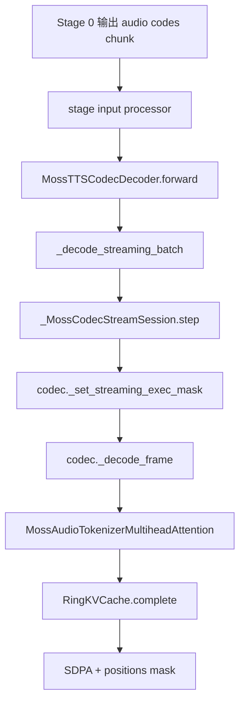
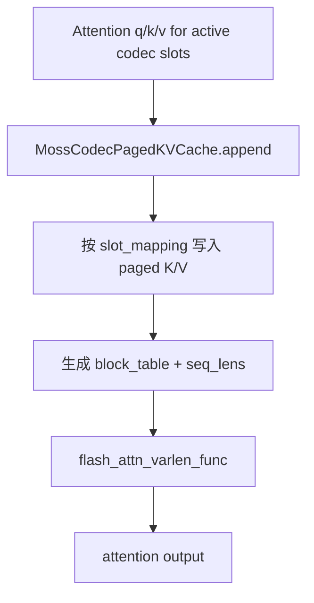

# MOSS-TTS Local v1.5 Codec Paged KV 设计

## 背景问题

MOSS-TTS Local v1.5 的 stage-1 codec 使用 MOSS Audio Tokenizer v2。当前
streaming codec 路径里，每个 causal transformer attention layer 都维护自己的
`RingKVCache`：

```text
cache:      [2, B, H, context, D]
cache[0]:   key
cache[1]:   value
```

这里真正的算法语义是：

```text
sliding-window causal attention：每个 query 只能看最近 context 个历史 token
```

RingKV 只是这个语义的一种工程实现。它用固定长度数组保存最近 `context` 个
K/V，新 K/V 的写入位置是：

```text
physical_index = logical_position % context
```

因此一旦发生 wrap，物理顺序就不再等于时间顺序：

```text
physical index: 0  1  2  3  4  5  6  7
logical pos:    8  9 10 11  4  5  6  7
```

当前实现仍然正确，是因为 `RingKVCache.complete()` 会额外返回每个物理位置对应
的 logical `positions`，attention 再用这些 position 构造 bool mask，然后调用
SDPA。

这对 FlashAttention 不友好。FA 的 causal/window path 默认 K/V 是按时间顺序
排列的，或者通过 `block_table` 告诉它“逻辑 block 到物理 block 的映射”。当前
RingKV 的物理乱序 + 自定义 `positions` mask，不能直接喂给普通 FA causal/window
kernel。

## 目标

- 将 MOSS codec streaming attention 从 RingKV + SDPA 迁到本地 paged KV + FA。
- 第一版只做 codec-local paged KV，不接 vLLM scheduler 的 KV manager。
- 保持 `_MossCodecStreamSession` 现有 streaming slot 语义。
- 在 fp16/bf16 容差内保持和 RingKV + SDPA 输出一致。
- 保留 RingKV + SDPA fallback。

## 非目标

- 不改 stage-0 talker generation。
- 不改 API streaming/audio chunk contract。
- 不做 codec prefix cache。codec 是 sliding-window attention，历史太远的上下文
  会被主动丢掉，prefix cache 收益有限。
- 不支持训练。
- 第一版不依赖 vLLM scheduler block allocator。

## 当前 Streaming 路径



核心代码形态是：

```python
k, v, pos_k = state.kv_cache.complete(k, v, state.exec_mask)
pos_q = offset + torch.arange(T)
delta = pos_q - pos_k
attn_bias = (pos_k >= 0) & (delta >= 0)
attn_bias &= delta < context
x = F.scaled_dot_product_attention(q, k, v, attn_bias)
```

这个实现的重点是：K/V 可以按 ring 的物理顺序乱放，但 mask 通过 logical
position 修正了 attention 可见范围。

## 设计方案

新增一个 codec-local paged KV cache：

```text
MossCodecPagedKVCache
  负责一个 attention shape group 的物理 KV pages
  维护每个 stream slot 的 block_table 和 seq_len
  提供 reset(slot)、append(slot, k, v)、FA metadata view
```

第一版建议放在 `audio_tokenizer_v2.py` 或邻近 helper 文件里，不依赖 vLLM
request scheduler。



## 数据结构

### Cache Group

每组唯一 attention cache shape 需要一组 paged KV：

```text
num_heads
head_dim
context
dtype
device
block_size
max_stream_slots
```

第一版最简单的方式是：每个 `MossAudioTokenizerMultiheadAttention` 自己持有一个
`MossCodecPagedKVCache`。后面如果内存压力明显，再考虑把 shape 相同的 layer
合并到共享 allocator。

### 物理 Cache Layout

尽量使用 vLLM cache write op 兼容的布局：

```text
kv_cache:    [num_blocks, 2, block_size, num_heads, head_dim]
key_cache:   kv_cache[:, 0]
value_cache: kv_cache[:, 1]
```

如果具体 FA/backend 要求 key/value 分开，也可以内部存成：

```text
key_cache:   [num_blocks, block_size, num_heads, head_dim]
value_cache: [num_blocks, block_size, num_heads, head_dim]
```

真正实现前需要用一个 tiny smoke test 确认当前 workspace 里的 FA wrapper 接受哪种
paged-cache layout。

### 每个 Stream Slot 的状态

每个 codec stream slot 维护：

```python
class SlotState:
    seq_len: int
    blocks: list[int]       # logical block order, oldest -> newest
    write_pos: int          # seq_len % block_size
```

对于 context 为 `C` 的 sliding-window attention，每个 slot 最多保留：

```text
max_blocks_per_slot = ceil(C / block_size) + 1
```

多出来的一个 block 用来处理 tail block 未满以及 block rollover。

### Block Table

对 active batch slots 暴露：

```text
block_table: [B, max_blocks_per_slot], int32
seq_lens:    [B], int32
```

`block_table[b]` 按时间顺序列出物理 block id。这个是 paged KV 相对 RingKV 的
核心变化：时间顺序不再靠 `positions` mask 恢复，而是直接由 block table 表达。

## Append 语义

attention projection 输出：

```text
k, v: [B, H, T, D]
exec_mask: [B]
```

先把 active rows 转成写入格式：

```text
new_k, new_v: [num_active * T, H, D]
slot_mapping: [num_active * T]
```

对每个 active codec slot、每个新 token：

```text
logical_pos = old_seq_len + token_offset
logical_block_idx = logical_pos // block_size
offset_in_block = logical_pos % block_size
physical_block = block_table[slot][logical_block_idx within retained window]
slot_mapping[token] = physical_block * block_size + offset_in_block
```

然后写 K/V。

第一版为了验证正确性，可以先直接写：

```python
key_cache[slot_mapping // block_size, slot_mapping % block_size] = new_k
value_cache[slot_mapping // block_size, slot_mapping % block_size] = new_v
```

正确性和 FA read path 验证通过后，再换成 vLLM cache write op：

```python
reshape_and_cache_flash(
    key=new_k,
    value=new_v,
    key_cache=key_cache,
    value_cache=value_cache,
    slot_mapping=slot_mapping,
    kv_cache_dtype="auto",
    k_scale=k_scale,
    v_scale=v_scale,
)
```

这样可以避免第一版同时引入“cache 状态 bug”和“写入 kernel layout bug”。

## Sliding Window 保留策略

每个 slot append 完后：

```text
seq_len += T
min_live_pos = max(0, seq_len - context)
first_live_block = min_live_pos // block_size
```

释放早于 `first_live_block` 的物理 blocks。剩余 `blocks` 继续保持 chronological
order。

FA 看到的是已经裁剪到最近 context 的 key sequence：

```text
[max(0, global_seq_len - context), ..., global_seq_len - 1]
```

因此 `seq_lens` 建议表示“当前 retained key tokens 数量”，上限是 `context`，而
不是无限增长的 global logical length。

FA 调用仍然保留：

```python
causal = True
window_size = [context - 1, 0]
```

当 retained K 已经不超过 context 时，`window_size` 更多是保护语义一致性的 guard。

## FA 调用形态

streaming chunk 的 query 仍然是连续 dense tensor：

```text
q: [B, H, T, D] -> [B * T, H, D]
```

K/V 保留在 paged cache 里。目标调用形态：

```python
out = flash_attn_varlen_func(
    q=q_flat,
    k=key_cache,
    v=value_cache,
    cu_seqlens_q=cu_seqlens_q,
    max_seqlen_q=T,
    seqused_k=seq_lens,
    max_seqlen_k=max_seq_len_k,
    block_table=block_table,
    dropout_p=0.0,
    causal=True,
    window_size=[context - 1, 0],
    fa_version=fa_version,
)
```

注意当前 workspace 里的 vLLM FA wrapper 约束：

- `block_table` 必须配 `seqused_k`。
- `block_table` dtype 应是 `torch.int32`。
- `seqused_k` dtype 应是 `torch.int32`。
- q/k/v dtype 必须是 fp16 或 bf16。
- K/V cache layout 必须和 FA wrapper 的 paged-cache 预期一致。

## `exec_mask` 处理

codec streaming 里可能有多个 stream slots，但每个 step 只有部分 slot active。
Paged KV 必须保持现有语义：

- active slot 写入 K/V，并推进 seq_len。
- inactive slot 不写入，不推进 seq_len。
- reset slot 释放 blocks，并清空 seq_len。

当前 RingKV 的 offset 推进逻辑是：

```python
state.offset = torch.where(state.exec_mask, state.offset + T, state.offset)
```

Paged KV 的 sequence state 必须和这个 offset 保持一致，否则 RoPE/position 和 KV cache
会错位。

## Reset 和生命周期

`_MossCodecStreamSession.release(slot)` 当前会调用 `reset_slots([slot])`。Paged KV 要挂
到同一个 streaming state reset 路径：

```python
def reset(reset_mask):
    for slot in reset_mask.nonzero():
        free all blocks for slot
        seq_len[slot] = 0
        block_table[slot].fill_(-1)
```

请求完成、abort、client disconnect 时，都不能残留 slot blocks。否则长期 streaming
会泄漏 block pool。

## 集成步骤

### 1. 加 feature flag

先默认关闭：

```text
moss_codec_paged_kv_attention: false
```

或者开发期用环境变量：

```text
VLLM_OMNI_MOSS_CODEC_PAGED_KV=1
```

fallback 继续走 RingKV + SDPA。

### 2. 先实现 direct-write Paged KV

先实现 `MossCodecPagedKVCache`，但 K/V 写入先用普通 tensor indexing，不急着接
`reshape_and_cache_flash`。

第一阶段只验证：

- block 分配是否正确
- block table 是否 chronological
- FA causal/window 语义是否和 RingKV + SDPA 一致

### 3. 对齐 RingKV 输出

加 debug/测试模式，对小输入同时跑两条路径：

```python
sdpa_out = ring_attention(...)
fa_out = paged_attention(...)
assert_close(sdpa_out, fa_out, atol=..., rtol=...)
```

测试用例至少包括：

- `T=1`
- `T=4`
- `T=15`
- `T > block_size`
- 不 wrap
- wrap 一次
- wrap 多次
- `exec_mask` 中存在 inactive slots
- reset 后复用 slot
- batch 内不同 slot 有不同 seq_len

### 4. 再接 vLLM cache write op

输出对齐后，再把 direct write 替换成：

```python
vllm._custom_ops.reshape_and_cache_flash
```

或者当前 backend 更合适的 wrapper。

### 5. 性能测量

分别计时：

- qkv projection
- KV append
- FA
- output projection
- stage1 codec 总耗时

对比：

```text
RingKV + SDPA fp16
Paged KV + direct write + FA
Paged KV + reshape_and_cache_flash + FA
```

测试时固定同一个文本、seed、chunk size、GPU。

## 正确性细节

### Causal 对齐

FA 在 `seqlen_q != seqlen_k` 时使用 bottom-right causal mask。streaming chunk 中：

```text
queries 是当前 chunk 的最后 T 个新位置
keys 是 retained sequence，包含刚 append 的新 token
```

只要先 append K/V 再调用 FA，FA 的 bottom-right causal 语义就和当前 RingKV 的
`pos_q - pos_k >= 0` 对齐。

### Window 语义

RingKV 当前允许：

```python
0 <= pos_q - pos_k < context
```

FA 对应：

```python
causal=True
window_size=[context - 1, 0]
```

前提是 K/V 按 chronological order 暴露。

### Non-Causal Attention

Paged KV 只针对 streaming causal attention。非 causal attention 第一版继续保留
现有 dense path，除非 profiling 明确显示需要优化。

### `weights_per_step`

部分 MOSS attention module 使用 `weights_per_step` schedule。当前 RingKV 初始化时：

```python
respect_exec_mask = not self.weights_per_step
```

Paged KV 第一版建议只支持普通 causal streaming attention。如果某层存在
`weights_per_step` 且写入/offset 语义不同，先让该层继续走 RingKV，后续单独验证。

## 内存估算

单个 attention layer：

```text
bytes = 2 * stream_slots * retained_blocks * block_size * num_heads * head_dim * dtype_size
```

其中：

```text
retained_blocks = ceil(context / block_size) + 1
```

RingKV 内存大约是：

```text
2 * stream_slots * context * num_heads * head_dim * dtype_size
```

Paged KV 主要多出每个 slot 最多一个 block 的碎片。

## 风险

- 当前 FA paged-cache layout 可能和简单的 `[num_blocks, block_size, H, D]` 假设不完全
  一致。需要先做 tiny smoke test。
- codec decoder 里不同 transformer/layer 的 `context`、`H`、`D` 可能不同。第一版
  用 per-layer cache ownership，避免过早做共享 allocator。
- 一个 chunk 可能跨多个 blocks，append 要正确处理 block rollover。
- reset/abort 必须释放 blocks，否则 stream slot pool 会长期泄漏。
- chunk 很小时，FA + block table overhead 可能不一定比 SDPA 快，需要实测。

## 待确认问题

- codec 最合适的 block size 是多少？建议先测 `16`、`32`、`64`。
- 第一版只支持 fp16，还是同时支持 bf16？
- 是否需要所有 causal codec attention modules 共享一个 allocator？还是 per-layer
  cache 已经足够？
- fallback 做全局开关还是 per-layer fallback？per-layer 更稳，但复杂一些。

## 推荐第一版 Patch

最小实现：

```text
MossAudioTokenizerMultiheadAttention
  if streaming and causal and dtype is fp16/bf16 and flag enabled:
      use MossCodecPagedKVCache + FA
  else:
      use RingKV + SDPA
```

第一版先 direct write，不接 `reshape_and_cache_flash`。命中时打印一次：

```text
MOSS codec paged-KV FlashAttention enabled: layer=... block_size=... context=...
```

等 correctness 和 timing 都确认后，再把写入替换成 vLLM 的 cache write kernel。
