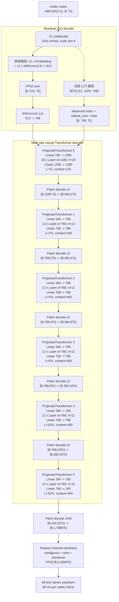
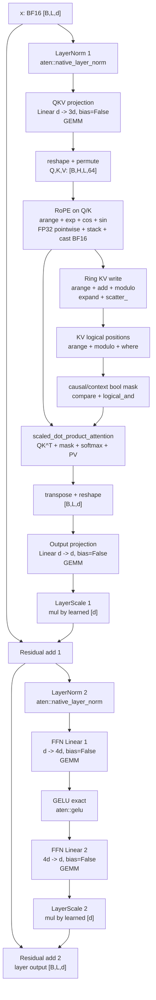

# MOSS-TTS Local v1.5 Codec Layer 与算子优化审查

## 1. 范围与结论

本文的结构和优化判断来自静态代码审查，不运行模型。目标是检查
`MOSS-Audio-Tokenizer-v2` decoder 中保留的 Hugging Face/PyTorch 实现，判断哪些
vLLM layer、CUDA op 和调度思想可以复用。

当前 BF16 codec 的 C8 结果是 RTF 0.433、TTFP 563 ms。基于代码结构，下一阶段最值得做的并不是把
`nn.Linear`、`F.gelu` 或 `nn.LayerNorm` 机械替换成同名 vLLM wrapper，而是：

1. 将 LFQ decode 的多级线性映射离线折叠为 code lookup table。
2. 缓存或复用 RoPE 的位置、频率和 cos/sin，进一步接入 vLLM fused rotary op。
3. 将同一个 Transformer stage 中每层重复构造的 ring index、position 和 attention mask 提升为
   stage 级元数据。
4. 中期为 codec 的多速率流式状态设计专用 slot mapping/block table，再复用 vLLM 的底层
   KV cache 与 FlashAttention kernel；不能直接替换为 vLLM `Attention`。

其中第 1 项是最独立的算子优化，第 2、3 项风险较低，第 4 项潜在收益最大但工程量也最大。

## 2. 当前 decoder 热路径

主要实现位于：

- `vllm_omni/model_executor/models/moss_tts/audio_tokenizer_v2.py`
- `vllm_omni/model_executor/models/moss_tts/modeling_moss_tts_codec.py`

模型配置对应的 decoder 是多速率结构：

| Stage | 内部帧率 | 层数 | hidden/head | context |
| --- | ---: | ---: | --- | ---: |
| Transformer 0 | 12.5 Hz | 32 | 1280 / 20，head dim 64 | 125 |
| Transformer 1 | 25 Hz | 12 | 768 / 12，head dim 64 | 250 |
| Transformer 2 | 50 Hz | 12 | 768 / 12，head dim 64 | 400 |
| Transformer 3 | 100 Hz | 12 | 768 / 12，head dim 64 | 400 |
| Transformer 4 | 200 Hz | 12 | 768 / 12，head dim 64 | 400 |
| Transformer 5 | 400 Hz | 12 | 768 / 12，head dim 64 | 400 |

总计 92 个 Transformer layer。每层包含：

- 一个已经融合 QKV projection 的 `nn.Linear(d, 3d)`；
- Python/PyTorch 实现的 RoPE；
- `RingKVCache.scatter_`、position 计算和布尔 attention mask；
- `F.scaled_dot_product_attention`；
- attention output projection；
- 两个标准 `nn.LayerNorm`；
- 非门控 FFN：`Linear -> GELU -> Linear`；
- 两次独立的 layer-scale 与 residual add。

decoder 前端还有 RLFQ decode。Local v1.5 实际使用 12 个 quantizer：每个 codebook 先 embedding，
再通过独立的 1x1 weight-normalized Conv1d 从 8 维映射到 512 维，12 路相加后再通过 512 到 768
的 1x1 Conv1d。

### 2.1 完整 decoder 结构

下图中的 `Tc` 是本次 `_decode_frame` 输入的 codec frame 数。模型是 48 kHz 双声道，左右声道在
Transformer 内部按时间交织，因此内部末端先产生 `7680 * Tc` 个单通道标量，再恢复为每声道
`3840 * Tc` 个 sample。一个 codec frame 对应 80 ms 音频。



每个 `ProjectedTransformer` 的输入和输出 projection 都是 `nn.Linear`，输入张量会在
`[B, D, L]` 与 `[B, L, D]` 之间用 `transpose` 切换。`Patch decode` 没有可训练参数，本质是
`reshape -> permute -> reshape`；最后一次 reshape 可能因 stride 不兼容而触发 materialization。

### 2.2 张量尺寸与时间尺度

| 位置 | 输出张量 | 相对长度 | 内部帧率 | 单层 KV capacity |
| --- | --- | ---: | ---: | ---: |
| LFQ decode | `[B, 768, Tc]` | 1 | 12.5 Hz | - |
| Transformer 0 | `[B, 1280, Tc]` | 1 | 12.5 Hz | 125 |
| Patch x2 | `[B, 640, 2Tc]` | 2 | 25 Hz | - |
| Transformer 1 | `[B, 768, 2Tc]` | 2 | 25 Hz | 250 |
| Patch x2 | `[B, 384, 4Tc]` | 4 | 50 Hz | - |
| Transformer 2 | `[B, 768, 4Tc]` | 4 | 50 Hz | 400 |
| Patch x2 | `[B, 384, 8Tc]` | 8 | 100 Hz | - |
| Transformer 3 | `[B, 768, 8Tc]` | 8 | 100 Hz | 400 |
| Patch x2 | `[B, 384, 16Tc]` | 16 | 200 Hz | - |
| Transformer 4 | `[B, 768, 16Tc]` | 16 | 200 Hz | 400 |
| Patch x2 | `[B, 384, 32Tc]` | 32 | 400 Hz | - |
| Transformer 5 | `[B, 240, 32Tc]` | 32 | 400 Hz | 400 |
| Patch x240 | `[B, 1, 7680Tc]` | 7680 | 96 kHz 交织标量 | - |
| Restore channels | `[B, 2, 3840Tc]` | 3840/声道 | 48 kHz/声道 | - |

这也是不能直接复用 LLM scheduler token metadata 的原因：外部 `Tc` 个 code frame 在六个 attention
stage 中分别变成 `Tc、2Tc、4Tc、8Tc、16Tc、32Tc` 个内部 query token。

### 2.3 单个 Transformer layer 的算子图

92 个 layer 都是 pre-norm、非门控 FFN，只有 `d_model`、head 数和 context 不同。head dim 恒为 64。



其中 attention 的缓存是 **per layer 独立** 的：

```text
cache       : BF16 [2, B, H, capacity, 64]   # K 和 V
end_offset  : int64 [B]                      # 每个 stream slot 的逻辑尾部
offset      : int64 [B]                      # RoPE/query position
exec_mask   : bool  [B]                      # 本轮活跃 slot
```

同一 stage 内 12 或 32 层的 offset、write slot、logical position 和 mask 语义完全相同，但当前由每层
分别计算。这正是 stage 级 metadata 复用的目标。

### 2.4 一次 `_decode_frame` 的算子重复次数

下表只统计 decoder 主干的概念算子调用，不展开 GEMM/SDPA 内部 kernel，也不含 channel restore：

| 算子 | 每个 layer | 92 层合计 | 额外 stage 调用 |
| --- | ---: | ---: | ---: |
| QKV Linear | 1 | 92 | 0 |
| Attention output Linear | 1 | 92 | 0 |
| FFN Linear | 2 | 184 | 0 |
| ProjectedTransformer input/output Linear | 0 | 0 | 12 |
| **Linear 总计** | **4** | **368** | **12，合计 380** |
| LayerNorm | 2 | 184 | 0 |
| RoPE | 1 | 92 | 0 |
| Ring KV write + position/mask | 1 | 92 | 0 |
| SDPA | 1 | 92 | 0 |
| GELU | 1 | 92 | 0 |
| LayerScale multiply | 2 | 184 | 0 |
| Residual add | 2 | 184 | 0 |
| Patch decode | 0 | 0 | 6 |

调用次数不随 `Tc` 变化，但各算子处理的 query 长度按 stage 从 `Tc` 增长到 `32Tc`。因此后四个
400-context stage 虽然 hidden size较小，attention、FFN 和 pointwise 的实际工作量仍然不可忽略。

### 2.5 Streaming KV 显存结构

单层 ring KV 的 BF16 字节数是：

```text
2(K/V) * B * H * capacity * 64(head_dim) * 2 bytes
```

以 `B=8` stream slots 计算：

| Stage | 单层 KV | 层数 | Stage KV |
| --- | ---: | ---: | ---: |
| Transformer 0：H=20, C=125 | 4.88 MiB | 32 | 156.25 MiB |
| Transformer 1：H=12, C=250 | 2.93 MiB | 12 | 35.16 MiB |
| Transformer 2：H=12, C=400 | 4.69 MiB | 12 | 56.25 MiB |
| Transformer 3：H=12, C=400 | 4.69 MiB | 12 | 56.25 MiB |
| Transformer 4：H=12, C=400 | 4.69 MiB | 12 | 56.25 MiB |
| Transformer 5：H=12, C=400 | 4.69 MiB | 12 | 56.25 MiB |
| **总计** | - | **92** | **约 416 MiB** |

`B=16` 时固定 ring cache 约翻倍为 833 MiB，不含模型权重、activation、CUDA Graph private pool 和
LFQ LUT。这解释了 slot 数直接决定 codec state 常驻显存，也说明 paged state 对非满载场景有价值；
但饱和 C8 时，paged 结构不会减少真正活跃请求所需的 K/V 数据。

## 3. Profile 证据边界

已有 `log-codec-with-graph.txt` 的旧 profile 中：

- 多组 GEMM 合计占主导；
- attention 的 `fmha_cutlassF_f32_aligned_64x64_rf_sm80` 约占 GPU 时间 18.08%；
- `native_layer_norm` 约 0.49%；
- GELU 约 0.17%；
- weight norm CUDA kernel 约 0.05%。

这份 profile 对识别结构热点仍有用，但它记录的是 FP32 GEMM/attention，早于当前 BF16 codec 改造。
不能把其中百分比当作当前 BF16 路径的收益预测。下面的优先级应在新的 BF16 profile 上用 kernel
dtype、调用次数和 CUDA 时间重新确认。

## 4. 优先级总览

| 优先级 | 项目 | 预期收益位置 | 工作量 | 语义风险 |
| --- | --- | --- | --- | --- |
| P0 | bake weight norm | 启动后每步小 kernel/graph 简化 | 低 | 低，等价 |
| P0 | LFQ decoded LUT | TTFP、短 chunk、kernel launch | 中 | 低到中，需验证舍入 |
| P0 | stage 级 RoPE cache/fused rotary | 全部 92 层 | 中 | 低，需核对布局 |
| P0 | stage 级 ring/mask 元数据复用 | 全部 92 层 | 中 | 低到中 |
| P1 | codec 专用 paged/ring FlashAttention | attention 主体 | 高 | 中到高 |
| P1 | slot state pool 与 active batch bucket | 非满载/错峰并发 | 高 | 中 |
| P1 | persistent buffer 与异步 D2H | step 尾部同步、TTFP | 中 | 中 |
| P2 | decoder 权重存储 BF16 | 带宽、显存、cast | 低到中 | 中 |
| P2 | compile 小型 pointwise region | launch 与 pointwise | 中 | 中 |
| P2 | 精简 CUDA Graph shape 集合 | graph 内存和预热 | 低 | 低 |

## 5. P0：LFQ decode 等价折叠

### 5.1 Bake weight norm

`WNConv1d` 使用 `nn.utils.parametrizations.weight_norm`。推理时参数不再变化，但 parametrization 会在
forward 前重建权重。项目内 Fish Speech codec 已有可直接复用的先例：加载 checkpoint 后调用
`remove_parametrizations(module, name, leave_parametrized=True)`，将最终权重固化。

建议 MOSS codec 在 `load_state_dict` 完成后、CUDA Graph capture 前执行相同处理。该改动数学上等价，
收益本身不会很大，但能消除 weight norm kernel 和 Python parametrization 路径，并简化后续 LUT
折叠及 graph。

### 5.2 预计算 decoded LUT

当前 12 个 quantizer 的 decode 可写成：

```text
y = W_outer * sum_i(W_i * E_i[code_i] + b_i) + b_outer
```

全部是推理期不变的线性变换，因此可在权重加载后预计算：

```text
LUT[i, code] = W_outer * (W_i * E_i[code] + b_i)
y = sum_i LUT[i, code_i] + b_outer
```

运行时从 12 次 embedding、12 次小 1x1 Conv1d、一次外层 Conv1d，变成 12 次 lookup、一次 reduction
和 bias add。也可以进一步写一个 Triton kernel，直接完成多 codebook gather、累加和布局输出。

以 12 个有效 quantizer、1024 code、768 output 估算：

- BF16 LUT 约 18 MiB；
- FP32 LUT 约 36 MiB；
- 若保留全部 32 个 quantizer，BF16 LUT 约 48 MiB。

建议只构建服务配置实际使用的 12 路 LUT。离线折叠使用 FP32，运行 LUT 先试 BF16；这在实数代数上
等价，但由于原路径存在 BF16 autocast 和分步舍入，不保证 bitwise 相同，必须做 waveform 回归。

该优化更可能改善首包和小 `T`，不会消除 decoder 后续 92 层 Transformer 的主 GEMM 成本。

## 6. P0：RoPE 优化

当前 `apply_rope` 在每层每步重复执行：

- `arange`；
- `exp` 生成频率；
- `cos`/`sin`；
- Q/K 转 FP32；
- 多个逐点运算与 `stack`；
- 转回输入 dtype。

所有层的 head dim 都是 64，同一 Transformer stage 内的 layer 还共享相同 offset 和当前 `T`。
因此至少应把频率、position、cos/sin 提升到 stage 级，只计算一次后传给 12 或 32 层。

vLLM 的 `RotaryEmbedding` 更进一步：

- 初始化时预计算 `cos_sin_cache`；
- CUDA 路径调用 in-place `ops.rotary_embedding`；
- 可按平台选择 FlashInfer rotary op。

MOSS 当前 RoPE 把相邻两维视作实部/虚部，对接时应使用与之匹配的 interleaved 布局，预计是
`is_neox_style=False`，并设置 `head_size=64`、`rotary_dim=64`、`base=10000`。正式替换前必须用随机
Q/K、不同 offset、BF16/FP32 对比现实现输出，不能只凭 shape 判断。

推荐分两步：

1. 先在现实现中缓存 inv-freq 和 stage 级 cos/sin，确认收益和等价性。
2. 再替换为 vLLM fused rotary op，减少 pointwise kernel 和中间 tensor。

## 7. P0/P1：KV cache 与 attention

### 7.1 当前重复开销

每个 `RingKVCache.complete`、每一层、每一步都重新构造：

- 当前写入 ring slot 的 `arange + offset + modulo`；
- 扩展到 `[B, H, T, D]` 的 scatter index view；
- 全 capacity 的 logical positions；
- invalid、causal、context 布尔 mask。

同一 stage 的所有 layer 拥有相同 batch state、offset、`T`、capacity 和 exec mask，只有 K/V 数据不同。
这些元数据不应在 12 或 32 层内重复计算。可在 `MossAudioTokenizerTransformer.forward` 入口生成
一次 stage metadata，由每层只消费 write slots、logical positions 和 attention metadata。

这是接入 paged attention 前值得先做的低风险版本。若仍保留 `F.scaled_dot_product_attention`，至少能
减少大量短小 pointwise/scatter-index kernel；若再写一个 ring-cache update Triton kernel，可避免
展开 `[B,H,T,D]` 的 scatter index。

### 7.2 为什么不能直接换成 vLLM Attention

vLLM `Attention` 的 cache write 和 attention backend 依赖 scheduler 提供的 `slot_mapping`、block table、
query start location 等 metadata。MOSS codec 的外部一次 code step 会经过多个 `patch_size=2` 上采样，
在六个 Transformer stage 中对应 12.5、25、50、100、200、400 Hz 的不同内部 token 数和位置。

当前 Stage1 scheduler 看到的是外部 code payload，不知道这些内部 token。因此直接把 MOSS MHA 换成
vLLM `Attention` 会使 slot、position、sequence length 和 sliding context 全部错位。

### 7.3 可复用的 vLLM 部分

可以复用的是底层能力和元数据设计：

- `reshape_and_cache_flash` 的 slot-based KV write；
- FlashAttention varlen/paged kernel；
- logical request row 与 physical KV slot 解耦；
- block table、slot recycling 和 active token metadata。

正确方向是为每个 codec resolution 维护独立的 logical length 与 slot mapping，再让底层 kernel 消费它，
而不是强行套用 LLM token 的 metadata。所有 attention 的 head dim 都是 64，适合 FlashAttention；旧
profile 还表明 arbitrary bool mask 走的是 PyTorch memory-efficient CUTLASS kernel，因此取消显式全
mask、改为 causal/window metadata 有明确的优化空间。

中期可以选择两种结构：

1. **固定 ring + FlashAttention**：保持当前固定 capacity，构建按时间顺序解释 ring 的 block table；
   适合现有固定 context，改动相对局部。
2. **codec paged KV**：每个 session、每个 resolution 按需分配 block；适合错峰并发与 session slot
   回收，但要处理六套内部长度，工程量更大。

饱和 C8 时固定 ring 的显存已经全部有效，paged KV 的主要收益会来自更合适的 attention kernel，而非
节省空槽。低并发、错峰到达、不同结束时间时，slot pool/paged state 的调度收益才更明显。

## 8. LayerNorm、residual 与 activation

### 8.1 不应把 LayerNorm 换成 vLLM RMSNorm

checkpoint 配置明确使用 `norm="layer_norm"`，实际实例是 `nn.LayerNorm`。虽然文件里定义了手写
`MossAudioTokenizerRMSNorm`，但该 checkpoint 的 Transformer 不走它。

vLLM 的 fused add + RMSNorm 会改变均值处理和参数语义，不能作为无损替换。当前
`aten::native_layer_norm` 本身已是 fused CUDA kernel，旧 profile 占比也很低。

可做的是保持 LayerNorm 语义，只融合相邻 pointwise：

```text
residual + layer_scale * attention_output
residual + layer_scale * ffn_output
```

92 层共有 184 个这类位置。可用小型 Triton kernel 或 `torch.compile` region 消除中间 tensor，但优先级
低于 RoPE、cache metadata 和 attention。

### 8.2 vLLM GELU wrapper 没有 CUDA 优势

vLLM `GELU.forward_cuda` 仍调用 `F.gelu(approximate="none")`。替换类名不会改变 CUDA kernel。
`GeluAndMul` 是 GEGLU/SwiGLU 类门控 FFN 的融合算子，而 MOSS 配置是 `gating="none"`，不能直接使用。

如果未来允许模型语义变化，才可讨论重新训练或校准为 gated FFN；它不属于当前等价推理优化。

## 9. Linear、精度与并行

### 9.1 vLLM Linear 不是 TP=1 的自动加速

当前 attention 已把 Q/K/V 合成一次 projection。vLLM 的 `QKVParallelLinear`、
`ColumnParallelLinear` 和 `RowParallelLinear` 主要提供 tensor-parallel shard、量化 dispatch 和统一权重
加载。TP=1、无量化时，把 `nn.Linear` 改名为 vLLM Linear 不会天然得到更快的 BF16 GEMM。

对 92 层 codec 做 TP 还会在每层引入 collectives。由于内部 `T` 很小，两次 collective/layer 很可能使
通信和 launch 成为主导。分卡更快的已观测结果更符合 Stage0/Stage1 或 talker/codec 隔离后减少资源
竞争，不等于 codec 自身适合 layer-wise tensor parallel。

### 9.2 权重存储 BF16

当前配置表达的是 FP32 storage、BF16 compute。整个 decode 已在 BF16 autocast 下运行，但权重仍可能
保留 FP32。将 decoder 权重直接转为 BF16 可减少显存和读带宽，并减少运行时转换/缓存压力；A100
Tensor Core 也能直接消费 BF16。

这值得作为独立实验，但不是严格无损：checkpoint 设计明确保留 FP32 weight，长期 streaming 误差可能
累积。建议只转换 decoder inference-only weight，保持 state/cache BF16，并用完整多 chunk 音频回归。

### 9.3 暂不优先量化和 FP8

- A100/SM80 没有 Hopper 级原生 FP8 Tensor Core 路径，不应优先移植 vLLM FP8 recipe。
- INT8/INT4 weight-only 对小 `M/N`、短 `T` 未必优于 BF16 GEMM，且有音频质量和 integration 风险。
- 应先从新 BF16 profile 确认 GEMM 是 compute-bound 还是 launch/memory-bound，再决定量化。

## 10. Patch、CUDA Graph 与输出同步

`PatchedPretransform.decode` 的 `reshape -> permute -> reshape` 可能因 stride 不兼容产生 materialization，
但每次 decode 只有六次，先用 profiler 看 `copy/contiguous` 时间再决定写 layout kernel，不应作为首项。

现有 streaming CUDA Graph 可以降低 Python/CUDA launch 开销，但 graph 不会自动融合 RoPE、mask、scatter
和 residual 的 pointwise kernel。更合适的顺序是：

1. 先消除重复 metadata 和不必要 kernel；
2. 再对纯 pointwise 小区域做 `torch.compile`；
3. 最后重新 capture 稳定 shape 的 graph。

若当前捕获 `T=1..15` 全部 shape，而实际常态只有首步 `T=1`、稳态 `T=15`，可测量只 capture 1 和 15、
尾包 eager 的策略。这主要减少预热和 graph 内存，不一定改善稳态 kernel 时间。

此外，session step 若在热路径中对 waveform 做同步 `.to("cpu")` 或对 length 调用 `.item()`，会形成
D2H barrier。可参考 vLLM runner 的 persistent staging buffer、pinned output buffer 和独立 copy stream，
让下一轮 GPU decode 与上一轮输出复制重叠。这个方向属于 runner/session 优化，不是 layer 替换，但对
TTFP 和并发尾延迟可能比 LayerNorm/GELU 微优化更有价值。

## 11. 明确不建议的替换

1. 不要仅为“使用 vLLM”把所有 `nn.Linear` 换成 vLLM Linear。
2. 不要把 checkpoint 的 LayerNorm 换成 RMSNorm。
3. 不要用 `GeluAndMul` 替代非门控 FFN。
4. 不要把 vLLM `Attention` 直接接到当前 codec state。
5. 不要在没有 collective profile 的情况下对 92 层 codec 做 tensor parallel。
6. 不要在 SM80 上优先投入 FP8 移植。
7. 不要先实现完整 paged KV，再补多速率 position/slot 语义；metadata contract 应先确定。

## 12. 推荐实施顺序

### 第一批：低风险等价优化

1. bake MOSS codec 全部 weight norm；
2. stage 级复用 position/ring metadata/mask；
3. 缓存 RoPE inv-freq/cos-sin，再评估 vLLM fused rotary；
4. 每项分别采 C1/C8 BF16 profile，禁止一次混入多个变量。

### 第二批：LFQ 特化

1. 实现 12 路 FP32 reference decoded LUT；
2. 验证 hidden/waveform；
3. 改为 BF16 LUT；
4. 如 gather/reduction launch 仍明显，再融合为一个 Triton op。

### 第三批：attention backend

1. 定义六个 resolution 的 logical length、slot mapping、reset/reuse contract；
2. 先做固定 ring block table + FlashAttention prototype；
3. 对比 PyTorch SDPA 的 GPU time、kernel 数、显存；
4. 只有在错峰/稀疏 session 确有收益时，再扩展为完整 codec paged KV/state pool。

## 13. 验证清单

每项优化至少覆盖：

- 单 chunk hidden output 的 max/mean absolute error；
- 多 chunk streaming waveform 的 max error、SNR 和长度；
- session reset、部分 batch reset、slot reuse 后无跨请求污染；
- C1/C8 的 RTF、TTFP、吞吐和 p50/p95 step latency；
- CUDA Graph capture 成功且稳态命中；
- RoPE trig、ring scatter/index、weight norm 和 attention kernel 调用次数；
- BF16/FP32 kernel dtype 是否符合预期；
- peak GPU memory 与 graph memory；
- 固定输入下 SIM/UTMOS/WER 或现有音频质量回归指标。

特别是 LUT、fused rotary、BF16 weight 三项，应分别验证长音频多 chunk 的误差累积，不能只比较第一帧。

## 14. 代码参考

- MOSS RoPE：`audio_tokenizer_v2.py:264`
- MOSS ring KV：`audio_tokenizer_v2.py:422`
- MOSS MHA：`audio_tokenizer_v2.py:540`
- MOSS Transformer layer：`audio_tokenizer_v2.py:693`
- MOSS weight-normalized Conv1d：`audio_tokenizer_v2.py:975`
- MOSS ResidualLFQ decode：`audio_tokenizer_v2.py:1278`
- Fish Speech bake weight norm 先例：
  `vllm_omni/model_executor/models/fish_speech/fish_speech_dac_decoder.py:135`
- vLLM fused rotary：`../vllm/vllm/model_executor/layers/rotary_embedding/base.py:139`
- vLLM fused RMSNorm/add：`../vllm/vllm/model_executor/layers/layernorm.py:37`
- vLLM GELU：`../vllm/vllm/model_executor/layers/activation.py:311`
- vLLM parallel linear：`../vllm/vllm/model_executor/layers/linear.py:914`
- vLLM FlashAttention KV write：`../vllm/vllm/v1/attention/backends/flash_attn.py:951`
