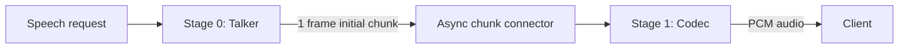
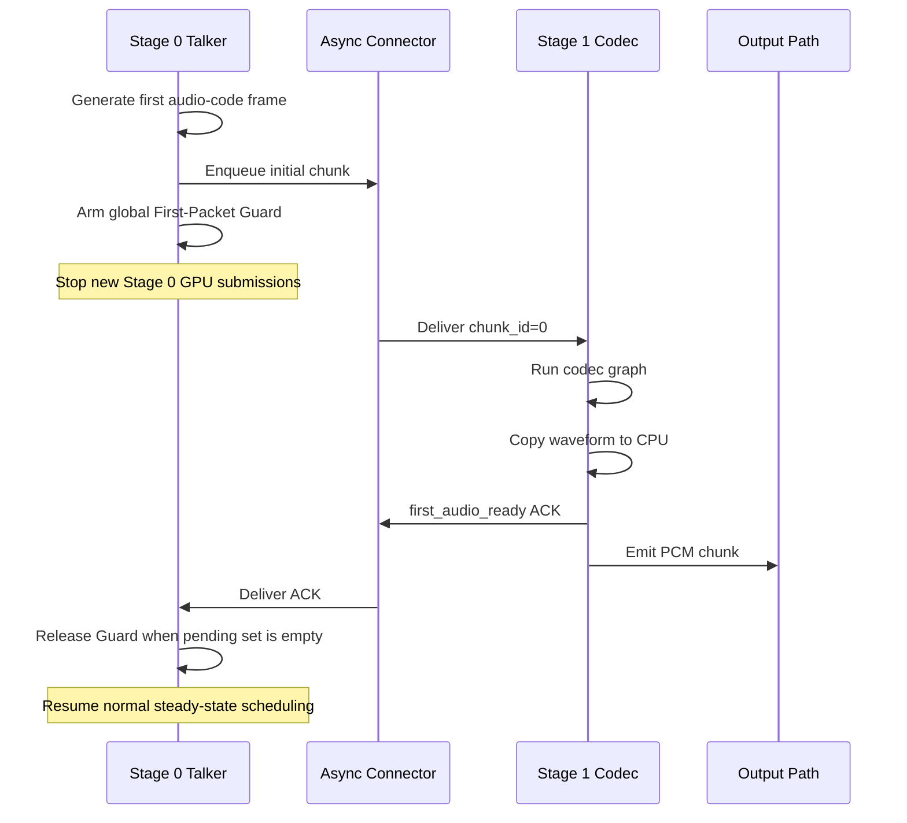

# RFC：MOSS-TTS-Local 单卡首包 GPU Guard

## 状态

草案，待通过 benchmark 验证。

## 摘要

MOSS-TTS-Local 在单卡部署时，Stage 0 talker 和 Stage 1 codec 分别运行在独立进程和 CUDA context 中。talker 接口重构移除了旧路径中的逐步 D2H 同步后，Stage 0 可以更连续地向 GPU 提交 kernel。Stage 0 自身计算时间没有明显增加，但 Stage 1 的首个 codec graph 更容易排队，导致 TTFP 恶化。

本文提议增加一个只覆盖首包关键路径的 `First-Packet GPU Guard`：Stage 0 发出首个 codec chunk 后，短暂停止整张卡上的 Stage 0 模型提交；Stage 1 完成首个 codec chunk 并把 waveform 拷贝到 CPU 后发回 ACK；Stage 0 收齐 ACK 后立即恢复，后续 steady-state chunk 不再限流。

该方案不恢复旧的逐帧 D2H，也不试图实现完整的跨 Stage QoS。第一阶段先用固定时间窗口验证收益，第二阶段再用 Stage 1 ACK 替代固定时间猜测。

## 背景

当前 MOSS-TTS-Local pipeline 为：



Stage 0 和 Stage 1 在 `moss_tts_local.yaml` 中都使用 GPU 0，并分别启用独立 scheduler：

```yaml
stages:
  - stage_id: 0
    devices: "0"
    async_scheduling: true
  - stage_id: 1
    devices: "0"
    async_scheduling: true
```

`gpu_memory_utilization` 只约束显存，不会为 Stage 1 预留计算资源。`codec_stream_slots` 约束 codec streaming session 的容量，也不会向 Stage 0 提供 GPU backpressure。

标准 vLLM 的 prefill/decode 工作通常由同一个 scheduler 统一组 batch。这里则是两个互不可见的 scheduler 向同一张卡提交工作：

```text
Stage 0 Scheduler -> CUDA context 0 --+
                                      +--> GPU 0
Stage 1 Scheduler -> CUDA context 1 --+
```

Stage 0 不知道 Stage 1 正在等待首包，Stage 1 也无法要求 Stage 0 暂停，因此局部正确的调度决策可能形成全局不公平。

## 现象与证据

对比的 profile 目录如下：

```text
Stage 0 性能较差：
results/moss_local_stage0/batch_8/20260717-173618_stage0_rank0_1784309778

Stage 0 性能较好：
results/moss_local_stage0/batch_8/20260717-174646_stage0_rank0_1784310406

Stage 1 性能较差：
results/moss_local_stage1/batch_8/20260717-173618_stage1_rank0_1784309778

Stage 1 性能较好：
results/moss_local_stage1/batch_8/20260717-174647_stage1_rank0_1784310407
```

主要观察：

1. Stage 0 CUDA 总时间接近：性能较差版本约 `903 ms`，性能较好版本约 `892 ms`。
2. Stage 1 CUDA 总时间从约 `1.399 s` 增加到 `1.539 s`，但 Stage 1 代码并没有对应修改。
3. Stage 1 首包的两个关键 codec graph 在竞争较强时分别增加约 `19 ms` 和 `14 ms`，总差值约 `33 ms`，与一次性 8 并发 benchmark 的 TTFP 差值接近。
4. 在 Stage 1 首包 graph 的时间窗口内，性能较差版本存在更多 Stage 0 kernel。
5. 旧 talker 路径中的小型 D2H 会等待前序 CUDA 工作，意外形成 Stage 0 节流；接口重构去掉该同步后，Stage 0 更容易提前填满 GPU 执行队列。

因此，这里的“抢占”更准确地说是跨进程 GPU 调度竞争和排队。它不要求 Tensor Core 或理论 FLOPS 达到 100%；SM block slot、寄存器、shared memory、显存带宽或者 context 调度窗口被 Stage 0 占用，都可能让 Stage 1 等待。

## 目标

1. 优先降低首个音频包的 TTFP。
2. 只保护 Stage 1 的首个 codec chunk，不改变 steady-state chunk 调度。
3. 不恢复逐帧 D2H 或逐帧 `cuda.synchronize()`。
4. 在 8 并发下允许 Stage 1 将首 chunk 合并成 batch 执行。
5. ACK 丢失、请求取消或 Stage 1 失败时必须 fail-open，不能永久阻塞 Stage 0。
6. 默认关闭，通过配置只在单卡共置部署中启用。

## 非目标

1. 不在本 RFC 中实现通用的多阶段 GPU QoS。
2. 不保证 CUDA kernel 级别的抢占。
3. 不处理 codec kernel 本身的算子优化。
4. 不用本方案替代 MPS、MIG 或物理分卡。
5. 不在 steady state 中按每个 codec chunk 做持续 backpressure。

## 为什么必须是全局 Guard

只暂停产生首 chunk 的 request 不足以保护 TTFP。

假设一个新请求正在等待 Stage 1 首包，而 Stage 0 还有七个已进入 steady state 的请求。即使新请求自身被暂停，其余七个请求仍会触发 Stage 0 batch 和 CUDA kernel，继续与 Stage 1 竞争。

因此，只要存在尚未完成的首包，Guard 应短暂阻止 Stage 0 的全部模型执行：

```text
错误：只暂停新请求
  new request: paused
  existing requests: Stage 0 kernels continue -> Stage 1 仍被干扰

正确：全局暂停 Stage 0 GPU submission
  new request: paused
  existing requests: paused briefly
  Stage 1: obtains a clean first-packet window
```

这会短暂推迟已有请求的 talker 生成，但现有 steady chunk 为 15 frame，即约 1.2 秒音频，理论上可以吸收一次约 100 ms 的短暂停顿。是否增加 underrun 仍需 benchmark 验证。

## 设计概览

方案分两阶段落地。

### Phase A：固定时间窗口

Stage 0 第一次提交 initial chunk 后，全局暂停 Stage 0 一段固定时间，例如 120 ms。这一阶段只验证调度假设，不增加反向控制协议。

### Phase B：Stage 1 完成 ACK

Stage 0 发出 initial chunk 后进入 Guard；Stage 1 完成首个 codec decode，并将 waveform D2H 到 CPU 后，通过 connector 发回 ACK。Stage 0 收齐当前 cohort 的 ACK 后立即恢复。



## 配置草案

建议先放在 connector `extra` 下，默认关闭：

```yaml
connectors:
  shm:
    name: SharedMemoryConnector
    extra:
      initial_codec_chunk_frames: 1
      codec_chunk_frames: 15
      codec_stream_slots: 8

      first_packet_gpu_guard: false
      first_packet_gpu_guard_mode: fixed  # fixed | ack
      first_packet_gpu_guard_ms: 120
      first_packet_gpu_guard_timeout_ms: 500
```

约束：

1. Phase A 只在 `initial_codec_chunk_frames == 1` 的 MOSS raw streaming 路径启用。
2. `fixed` 模式使用 `first_packet_gpu_guard_ms`。
3. `ack` 模式使用 Stage 1 ACK，但仍保留 `timeout_ms` 作为 fail-open 上限。
4. 多卡部署默认不启用，因为 Stage 0 和 Stage 1 不竞争同一张卡。

## 状态模型

### Per-request 状态

```text
UNSEEN
  |
  | first initial chunk candidate enqueued
  v
WAIT_FIRST_ACK
  |                    |
  | ACK received       | timeout / abort / terminal error
  v                    v
RELEASED            RELEASED_FAIL_OPEN
```

每个 request 最多进入一次 `WAIT_FIRST_ACK`。第二个及之后的 chunk 不改变该状态。

建议状态字段：

```python
first_packet_armed: set[str]
first_packet_pending: dict[str, float]  # request_id -> deadline
first_packet_released: set[str]
```

### 全局状态

```python
guard_active = bool(first_packet_pending)
```

当 `guard_active` 为真时，Stage 0 不执行新的模型 step。当前 cohort 的 ACK 必须全部到达后再恢复；只收到一个 ACK 就恢复会重新干扰其余请求的首包。

在 Guard 期间到达、但尚未生成首个 audio-code frame 的新请求不加入当前 pending set。当前 cohort 释放后，这些请求生成首帧并触发下一次 Guard。

## Phase A：固定窗口验证方案

### Arm 时机

Stage 0 在 `OmniARScheduler.update_from_output()` 中调用 `save_async()` 的位置，可以观察到第一个有效 `inter_stage_output`：

```python
self.chunk_transfer_adapter.save_async(
    inter_stage_output,
    request,
    is_segment_finished,
)
```

MOSS-TTS-Local 配置为 `initial_codec_chunk_frames=1`，因此第一个有效 frame 就会形成 initial chunk。Guard 必须在 scheduler 线程中立即 arm，不能等后台 `_send_single_request()` 成功后再 arm，否则 async scheduling 可能已经继续提交更多 Stage 0 工作。

伪代码：

```python
if adapter.should_arm_first_packet_guard(request, inter_stage_output):
    adapter.arm_first_packet_guard(
        request.external_req_id,
        deadline=time.monotonic() + guard_ms / 1000.0,
    )
```

`should_arm_first_packet_guard()` 必须幂等，并确认：

1. 功能已启用。
2. 当前是 Stage 0。
3. request 尚未 arm/release。
4. `inter_stage_output` 包含有效 MOSS audio-code frame。
5. `initial_codec_chunk_frames == 1`。

### 暂停方式

不建议在 scheduler 中直接 `sleep(120ms)`，因为这会延迟 abort 和状态清理。建议沿用现有 adapter 的临时 hold-queue 模式：

1. `schedule()` 开始时清理过期 guard。
2. 如果 guard 仍有效，将 running 和 waiting request 临时移入私有 hold queue。
3. 调用基础 scheduler，生成一个合法的空 scheduling step。
4. 在 `finally` 中恢复队列。

这避免手工构造不完整的 `SchedulerOutput`，也不修改 request/KV cache 生命周期。

建议依次测试：

```text
first_packet_gpu_guard_ms = 80
first_packet_gpu_guard_ms = 120
first_packet_gpu_guard_ms = 160
```

如果固定窗口能显著降低 TTFP，即可进入 ACK 方案；如果无收益，应先重新检查 Stage 0/Stage 1 时间线，而不是继续增加 guard 时间。

## Phase B：ACK 方案

### 首 chunk 标识

Stage 0 当前通过 `put_req_chunk[external_req_id]` 生成 chunk id。首 chunk 为 `chunk_id == 0`。

Stage 1 接收时应保存当前 source chunk id，例如：

```python
current_input_chunk_id[request_id] = chunk_id
```

不建议通过 `get_req_chunk == 1` 间接推断，因为后台 receiver 未来可能提前读到后续 chunk。显式保存当前被 schedule 的 chunk id 更稳健。

### ACK 发送时机

ACK 必须满足：Stage 1 首个 codec GPU 工作已经结束，首个 waveform 已可交给输出路径。

MOSS codec streaming session 当前在返回前执行：

```python
audio = audio_tensor.detach().to("cpu", torch.float32)
lengths = lengths_tensor.detach().to("cpu")
```

该 D2H 会等待 codec graph 完成。因此可以在 Stage 1 `update_from_output()` 收到非空首个 audio output 后调用：

```python
chunk_adapter.ack_first_packet_ready(request_id, source_chunk_id=0)
```

ACK 不应在以下时机发送：

1. Stage 1 刚从 connector 取到 chunk 时。
2. Stage 1 刚把 request 加入 waiting/running queue 时。
3. codec slot 不足、没有产生非空 audio 时。
4. CUDA graph 仅完成 enqueue、但 waveform 尚未 D2H 时。

### ACK 传输

复用 connector 发送一个反向小型 control payload：

```text
from_stage = "1"
to_stage   = "0"
key        = "{external_req_id}__ctrl__stage1_first_audio_ready_0"
payload    = {
    "type": "first_audio_ready",
    "request_id": external_req_id,
    "chunk_id": 0,
}
```

ACK 每个请求只发送一次，并要求发送端和接收端都幂等。重复 ACK 或超时后到达的 ACK 直接忽略。

Stage 0 的 `OmniChunkTransferAdapter.process_pending_chunks()` 当前会在 `stage_id == 0` 时直接返回。ACK 模式可以把该分支改为：

1. 非阻塞轮询 pending request 的 ACK key。
2. 将收到的 ACK 放入 scheduler 可见的 control-event queue。
3. scheduler 每轮 drain control events，更新 `first_packet_pending`。
4. pending set 为空时释放全局 Guard。

生产实现应避免无 pending ACK 时轮询，也应避免 1 ms busy spin。理想做法是 ACK receiver 收到消息后唤醒 EngineCore；MVP 可以先复用现有 scheduler tick。

### 为什么不通过 Orchestrator ACK

Orchestrator 能看到 final Stage 1 output，因此从语义上也可以发 ACK。但它需要新增 Orchestrator 到 Stage 0 EngineCore 的 request-level control message，并让 Stage 0 scheduler 消费该消息，改动面更大。

connector 反向 ACK 更贴近 async chunk 数据路径，且本地 SHM connector 已经支持基于 key 的双向 `put/get`。如果后续要把 First-Packet Guard 推广成通用跨 Stage QoS，再考虑提升到 Orchestrator control plane。

## 与 async scheduling 的关系

Guard 在 Stage 0 `update_from_output()` 中 arm 时，async scheduling 可能已经提交了最多一轮额外工作。Guard 不能取消已经进入 CUDA 队列的 kernel，只能阻止后续提交。

第一阶段先接受这一轮有限的 launch-ahead，并通过 profile 判断它是否仍然显著影响 Stage 1。如果仍有明显竞争，再考虑：

1. 首包阶段临时关闭 Stage 0 one-step lookahead；或
2. 在 Stage 0 model execution 和 scheduler 之间增加 first-output completion event。

不应直接恢复每一帧的同步，因为这会把一次性首包保护扩大成 steady-state 性能损失。

## 并发行为

### 8 个请求同时启动

Stage 0 在同一个 batch 中为 8 个请求生成首帧，pending set 包含 8 个 request。Stage 0 全局暂停；Stage 1 将 8 个 initial chunk 组成 codec batch；8 个 ACK 收齐后恢复。这是当前 benchmark 的主要目标场景。

### 已有 steady-state 请求时加入新请求

新请求发送 initial chunk 后，Stage 0 全局短暂停顿，包括已有请求。否则已有请求仍会生成 Stage 0 kernel，无法真正保护新请求的 Stage 1 首包。

### Guard 期间又有新请求到达

新请求保留在 waiting queue，不加入当前 pending cohort。当前 Guard 释放后先允许它生成首帧，然后触发下一次 Guard。

持续高到达率下可能频繁触发 Guard，降低总吞吐。这是首包优先策略的预期代价，后续可以增加 cohort 窗口或单位时间 Guard 上限，但不属于第一版范围。

## 异常处理

### ACK 超时

超过 `first_packet_gpu_guard_timeout_ms` 后 fail-open：

1. 从 pending set 删除 request。
2. 记录 timeout metric 和 warning。
3. 如果 pending set 为空，立即恢复 Stage 0。

### Request abort

Stage 0 和 Stage 1 cleanup 都必须删除该 request 的 guard、ACK 和 chunk-id 状态。abort 不应等待 ACK。

### Stage 1 terminal error

Stage 1 发生错误时应发送 release/error ACK，或者依赖 Stage 0 timeout fail-open。优先发送显式 error ACK，以减少不必要的 500 ms 停顿。

### ACK 重复或迟到

ACK 是幂等事件。已 release、已 abort 或已 timeout 的 request 收到 ACK 时直接忽略。

### 首 chunk 发送失败

Guard 在实际 connector put 之前 arm，因此发送失败可能导致无 ACK。timeout 必须覆盖这一情况。后续可以从 `_send_single_request()` 回传 send-failed control event，提前 fail-open。

### Request id 复用

ACK key 应包含 request generation、segment epoch 或不可复用的内部 request id，避免旧 ACK 释放新请求。普通非 resumable speech request 可以先使用内部 request id；realtime/resumable 模式需要显式 epoch。

## 线程安全

以下路径运行在不同线程：

1. scheduler/update-from-output 线程；
2. connector save thread；
3. connector receive/control thread。

不建议多个线程直接修改同一个 pending set。建议由 scheduler 独占状态，后台线程只写入轻量 control-event queue：

```python
ControlEvent = ArmSent | AckReceived | SendFailed | RequestAborted
```

scheduler 在每轮 `schedule()` 开始时 drain queue，然后统一更新状态。Phase A 的 arm 直接发生在 scheduler 线程，不需要跨线程同步。

## 可观测性

建议增加以下指标或 debug timestamps：

```text
first_packet_guard_armed_total
first_packet_guard_released_total
first_packet_guard_timeout_total
first_packet_guard_active_requests
first_packet_guard_wait_ms

first_chunk_enqueued_ts
first_chunk_put_ts
first_chunk_codec_done_ts
first_packet_ack_sent_ts
first_packet_ack_received_ts
stage0_guard_released_ts
```

这些时间点可以区分：

1. Stage 0 到 connector 的延迟；
2. connector 到 Stage 1 admission 的延迟；
3. Stage 1 codec GPU 时间；
4. ACK 传输延迟；
5. Stage 0 是否因为 timeout 而非正常 ACK 恢复。

## Benchmark 计划

所有实验应使用 warm cache，并至少运行两次，丢弃第一次 ref-audio cache 冷启动数据。

### Case A：一次性 8 并发 profiling

用于观察纯首包窗口：

1. Guard disabled。
2. Fixed guard 80 ms。
3. Fixed guard 120 ms。
4. Fixed guard 160 ms。
5. ACK guard。

收集：

1. mean/median/P99 AUDIO_TTFP；
2. Stage 1 首个 codec graph duration；
3. Stage 1 首包 graph 窗口内的 Stage 0 kernel union time；
4. Stage 0 空闲窗口；
5. mean AUDIO_RTF 和总 audio throughput。

### Case B：100 requests，concurrency=8

用于观察 steady-state 代价：

1. mean/median/P99 AUDIO_TTFP；
2. mean/median/P99 AUDIO_RTF；
3. request throughput；
4. audio throughput；
5. streaming underrun；
6. Guard 触发次数、平均等待和 timeout 数量。

### Case C：错峰请求

保持若干 steady-state 请求运行，再加入新请求，验证全局 Guard 能保护新请求 TTFP，并量化已有请求的 underrun/TPOT 影响。

## 验收标准

以下为初始目标，最终阈值以稳定 benchmark 为准：

1. 一次性 8 并发 TTFP 接近已知性能较好版本，差距不超过 10%。
2. Stage 1 首包 graph 窗口内的 Stage 0 kernel 时间显著下降。
3. 100-request concurrency=8 的 mean RTF 和 throughput 回归不超过 3%。
4. steady-state audio underrun 不出现显著恶化。
5. 正常运行无 ACK timeout。
6. abort、Stage 1 error 和 connector send failure 不会永久暂停 Stage 0。

不同 benchmark harness 的绝对 TTFP 不可直接比较。例如一次性 8 并发 profiling 中约 260 ms 的 TTFP，不能直接与 100-request concurrency=8 中约 700 ms 的 TTFP 比较；验收必须在同一 harness、同一输入和同一 warmup 条件下做 A/B。

## 备选方案

### 恢复旧 D2H

不采用。旧 D2H 只是偶然形成调度节流，作用范围是逐帧，steady-state 成本过高，而且把调度语义隐藏在数据搬运中。

### 仅做一次 `torch.cuda.synchronize()`

不足以保证 Stage 1 已完成。它只能等待 Stage 0 自己已提交的 CUDA 工作，Stage 0 同步返回时 Stage 1 仍可能刚开始执行或仍在排队。

### 只暂停新请求

不采用。其他 Stage 0 请求仍会向同一张 GPU 提交 kernel，无法提供干净的 Stage 1 首包窗口。

### CUDA high-priority stream

当前是两个独立 CUDA context，普通 stream priority 不能可靠解决跨进程调度；即使同一 context，priority 也不能抢占已经运行的 kernel。

### CUDA MPS priority

可以作为独立实验，但 MPS priority 仍是 hint，并且不能抢占已运行 kernel。First-Packet Guard 是应用层确定性策略，能明确阻止 Stage 0 继续填充队列。两者未来可以组合。

### 分卡或 MIG

隔离最强，但增加显存和部署成本，不属于单卡共享资源场景下的首选方案。

## 实施顺序

1. 增加配置解析和 Phase A 固定窗口 Guard，默认关闭。
2. 增加 Guard metrics 和关键时间戳。
3. 跑 80/120/160 ms 的一次性 8 并发 A/B，并重新采集 Stage 0/Stage 1 profile。
4. 如果 TTFP 明显恢复，实现 source chunk id 跟踪和 Stage 1 ACK。
5. 将 fixed 模式保留为诊断工具，生产默认使用 ack 模式。
6. 增加 abort、timeout、重复 ACK、发送失败和 8-request cohort 单元测试。
7. 跑 100-request concurrency=8 和错峰请求 benchmark，确认 steady-state 回归可接受。

## 预计改动范围

Phase A：

```text
vllm_omni/deploy/moss_tts_local.yaml
vllm_omni/core/sched/omni_ar_scheduler.py
vllm_omni/distributed/omni_connectors/transfer_adapter/chunk_transfer_adapter.py
```

Phase B 额外涉及：

```text
vllm_omni/core/sched/omni_generation_scheduler.py
vllm_omni/distributed/omni_connectors/transfer_adapter/chunk_transfer_adapter.py
vllm_omni/distributed/omni_connectors/connectors/shm_connector.py  # 仅在需要 control helper 时
```

codec model 本身原则上不需要修改；Stage 1 ACK 应由 scheduler/adapter 在观察到首个非空 CPU audio output 后发送，避免把跨 Stage 调度协议写进模型实现。

## 开放问题

1. Stage 0 async scheduling 实际最多会在 Guard arm 前多提交多少轮工作？
2. 固定 120 ms 是否足以覆盖不同 GPU 和不同 Stage 1 batch size？
3. Stage 1 ACK 应在 scheduler update 后立即发送，还是在 final output queue enqueue 后发送？前者更早，且当前 codec D2H 已完成；后者语义更接近客户端首包，但需要 Orchestrator control plane。
4. 错峰请求下，一次 Guard 对已有 stream underrun 的影响是多少？
5. 高频新请求是否需要 1–2 ms cohort admission window，减少连续 Guard 次数？
6. 通用化后，Guard 应属于 async chunk adapter、pipeline scheduler，还是 Orchestrator QoS 层？

## 结论

当前 TTFP 回归的核心不是 Stage 1 代码变慢，而是 Stage 0 talker 重构后移除了隐式同步，使两个独立 CUDA context 在单卡上的调度更加偏向 Stage 0。恢复逐帧同步会牺牲整个生成过程的性能。

First-Packet GPU Guard 将限流范围缩小到首个 codec chunk：Stage 0 只为 Stage 1 让出一次短暂而明确的 GPU 窗口，首包完成后立即恢复正常流水线。固定窗口适合快速验证，Stage 1 ACK 是更可靠的生产方案。
