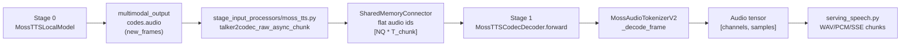
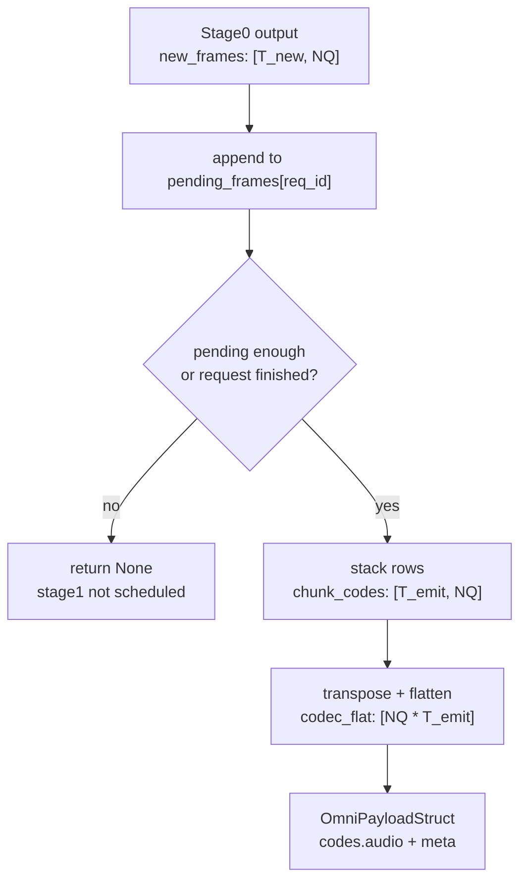
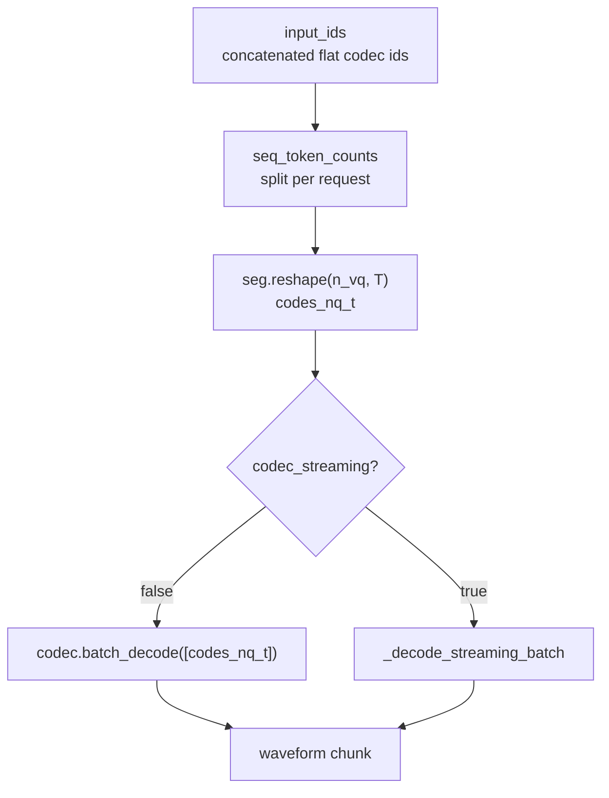
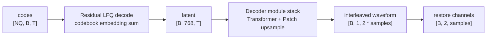
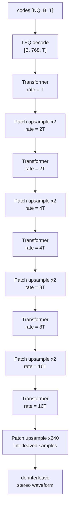
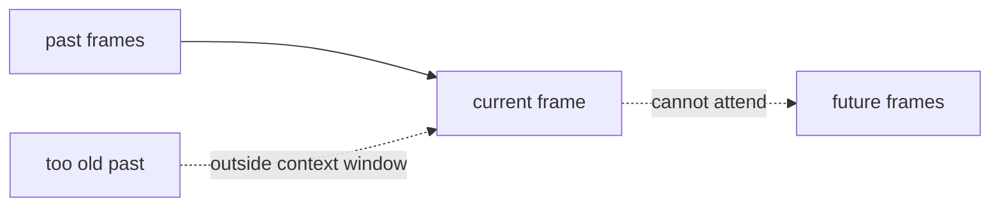
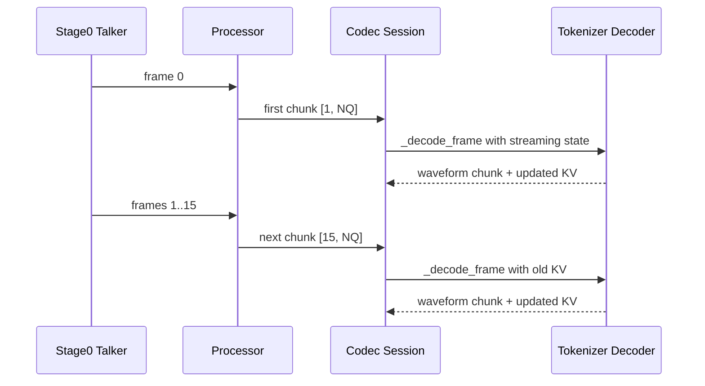

# MOSS-TTS-Local v1.5 Codec Pipeline

本文说明 MOSS-TTS-Local v1.5 在 vLLM-Omni 中从 talker audio code 到最终 waveform
的完整 codec 链路。重点不是模型训练结构，而是 serving 时每个 stage 传什么数据、
shape 怎么变、哪些部分是 causal/streaming stateful，以及为什么不能简单把它当成普通
LLM AR runner。

相关代码：

- `vllm_omni/model_executor/stage_input_processors/moss_tts.py`
- `vllm_omni/model_executor/models/moss_tts/modeling_moss_tts_codec.py`
- `vllm_omni/model_executor/models/moss_tts/audio_tokenizer_v2.py`
- `vllm_omni/deploy/moss_tts_local.yaml`

## 一句话结论

MOSS-TTS-Local v1.5 的 stage0 talker 每个 global step 生成一帧 codec code。对
`n_vq=12`，一帧就是 12 个 codebook id。stage1 codec decoder 把若干帧 `[T, 12]`
重新整理成 `[12, T]`，交给 MOSS Audio Tokenizer v2 的 decode path，输出 48 kHz stereo
waveform。

MOSS Audio Tokenizer v2 本身是一个 causal transformer codec：encoder 和 decoder 都能
流式运行。vLLM-Omni 的 local v1.5 只用它的 decoder 侧，也就是 `codes -> waveform`。

## 端到端数据流



关键 shape：

```text
Stage 0 generated frames:      [T_chunk, n_vq]
Local v1.5 n_vq:               12
Connector payload audio ids:   [n_vq * T_chunk]
Stage 1 restored codes:        [n_vq, T_chunk]
Tokenizer decode input:        [n_vq, B, T_chunk]
Tokenizer output before slice: [B, channels, samples]
Local v1.5 waveform:           48 kHz stereo, channels = 2
```

## Stage 0 输出的是什么

Local v1.5 的 talker 不是直接输出 waveform，也不是输出文本 token。它输出音频 codec
帧。每个音频帧包含 `n_vq` 个离散 codebook id。

```text
frame 0: [q0_code, q1_code, ..., q11_code]
frame 1: [q0_code, q1_code, ..., q11_code]
frame 2: [q0_code, q1_code, ..., q11_code]
...
```

如果一个 chunk 里有 15 帧，stage0 到 stage1 的逻辑形态就是：

```text
[15, 12]
```

stage input processor 会把它转成 codebook-major 的 flat payload：

```python
codec_flat = chunk_codes.transpose(0, 1).contiguous().reshape(-1)
```

也就是：

```text
chunk_codes: [T, NQ]
transpose:   [NQ, T]
flatten:     [NQ * T]
```

这样 stage1 只要：

```python
codes_nq_t = seg.reshape(self._n_vq, t_chunk)
```

就能恢复成 `[NQ, T]`。

## Stage Input Processor 的职责

`talker2codec_raw_async_chunk` 负责把 stage0 的 per-step output 变成 stage1 可消费的
payload。它主要做四件事：

1. 收集新生成的 audio frames。
2. 按 `initial_codec_chunk_frames` 和 `codec_chunk_frames` 决定什么时候发给 stage1。
3. 把 `[T, NQ]` 转成 flat `[NQ * T]`。
4. 在 `meta` 里带上 streaming 状态，例如 `req_id`、`codec_streaming`、`stream_finished`。



Local streaming 配置通常是：

```yaml
initial_codec_chunk_frames: 1
codec_chunk_frames: 15
codec_streaming: true
```

含义：

- 第一包只等 1 frame，尽快产生首包音频。
- 后续每 15 frames 发一次，约 `15 * 80 ms = 1.2 s` 的 codec 音频上下文。
- stage1 以 streaming mode decode，保留 codec decoder 的 causal KV state。

## Stage 1 Codec Decoder

stage1 模型是 `MossTTSCodecDecoder`。它不是 AR sampling model，没有 logits，也没有
token sampler。它只负责：

```text
audio code ids -> waveform
```

入口是 `MossTTSCodecDecoder.forward`：



非 streaming path 简单一些：

```python
out = self._codec.batch_decode(codes_list=[codes_nq_t], num_quantizers=self._n_vq)
```

streaming path 会进入 `_MossCodecStreamSession`：

```python
self._exit_stack.enter_context(codec.streaming(self._batch_size))
self._codec._set_streaming_exec_mask(exec_mask)
result = self._codec._decode_frame(codes_step, codes_lengths)
```

这里 `codec.streaming(batch_size)` 会让 tokenizer 内部每个 streaming module 初始化自己的
state，包括 attention offset 和 ring KV cache。

## Audio Tokenizer v2 Decode Path

`MossAudioTokenizerModel._decode_frame` 是真正的 code2wav 主干：



核心代码形态：

```python
zq = quantizer.decode_codes(codes)

d, d_lengths = zq, codes_lengths
for decoder_module in self.decoder:
    d, d_lengths = decoder_module(d, d_lengths)

d, d_lengths = self._restore_channels_from_codec(d, d_lengths)
```

Local v1.5 只用前 12 个 quantizer：

```text
codec checkpoint has num_quantizers = 32
local talker emits n_vq = 12
stage1 calls num_quantizers = 12
```

## Decoder 内部的多级时间分辨率

Audio Tokenizer v2 的 public waveform 是 48 kHz stereo。因为启用了 channel interleave，
内部会把左右声道交错成单通道序列：

```text
L0, R0, L1, R1, L2, R2, ...
```

对外的 `downsample_rate=3840` 表示：

```text
1 codec frame = 3840 samples/channel = 80 ms at 48 kHz
frame rate = 48000 / 3840 = 12.5 fps
```

内部 decoder 是多级上采样：



这也是为什么它不能直接当成一个普通 LLM decoder：里面有多组 causal transformer，而且
每组 transformer 的时间轴长度不同。

## Causal 和 Non-Causal 的关系

`audio_tokenizer_v2.py` 的模块定义支持两种模式：

```python
causal: bool = False
```

但 MOSS Audio Tokenizer v2 的实际 config 里，encoder 和 decoder Transformer 都是：

```python
"causal": True
```

所以 local v1.5 的 codec decode 实际走 causal attention。

attention mask 逻辑是：

```python
delta = pos_q - pos_k
attn_bias = (pos_k >= 0) & (delta >= 0)
if self.context is not None:
    attn_bias = attn_bias & (delta < self.context)
```

含义：

```text
pos_k < 0:           ring cache 中还没有有效历史，mask 掉
delta >= 0:          只能看当前位置和过去位置
delta < context:     只能看最近 context 个位置
```

图示：



更直观地说，某个 query position `t` 能看的 key position 是：

```text
max(0, t - context + 1) ... t
```

如果 `context=None`，就是普通 causal attention，可以看所有历史。

## Streaming State 和 Ring KV Cache

streaming decode 时，stage1 不会每次把全部历史 codes 重新 decode。它会让 tokenizer
内部的 causal transformer 保存 KV cache。



`RingKVCache` 的核心思想：

- 固定容量是 `context`。
- 新 K/V 写到 `end_offset % capacity`。
- attention 时返回整个 ring buffer 和每个位置对应的 logical position。
- mask 用 logical position 判断哪些 key 有效、哪些太旧、哪些是未来。

```text
physical cache slots:
  [0] [1] [2] [3] [4] [5] [6] [7]

logical positions after wrap:
  8   9   10  11  4   5   6   7

mask uses logical positions, not physical order.
```

这就是为什么 streaming path 不能无脑套普通 FlashAttention contiguous causal：K/V 的物理
顺序是 ring layout，真正语义靠 `positions` 和 bool mask 还原。

## 为什么不能直接复用 vLLM AR Runner

MOSS codec decoder 虽然是 causal，但它不是 LLM-style AR decoder。

```text
LLM AR runner:
  one token step
  one transformer stack
  one KV cache layout
  logits + sampler + stop

MOSS codec decoder:
  one chunk of codec frames
  multiple transformer stacks at different rates
  internal patch upsample
  waveform output
  no logits / no sampler
```

因此更现实的优化路径是：

1. 复用 vLLM 的局部 fused op，例如 RoPE、FlashAttention fast path。
2. 保留 MOSS codec 自己的 session/slot/state 管理。
3. 如果以后多个 audio codec 都需要这种能力，再抽象一个 stateful causal codec runner。

## 当前优化切入点

按收益和风险排序：

1. **固定 stream slot batch 浪费**
   `codec_stream_slots=8` 时，即使只有一个活跃 request，也可能按 batch 8 跑 decoder。
   `exec_mask` 保护 state，但不一定减少所有计算。低并发 benchmark 应该先测
   `codec_stream_slots=1`。

2. **LFQ decode fusion**
   当前 `decode_codes` 循环 12 个 quantizer 做 embedding/out_proj/sum。可以预计算
   dequant table，把它变成 gather + reduce。

3. **RoPE cache/fused RoPE**
   原实现每层每次重新算 `arange/exp/cos/sin`。缓存 cos/sin 或接 vLLM fused RoPE 都能减少
   小 kernel 和重复计算。

4. **非 streaming full-chunk FlashAttention**
   non-streaming path 的 K/V 是 contiguous causal，可以走 vLLM FA。streaming ring-cache path
   需要额外适配，不能直接替换。

5. **Streaming graph capture**
   可以尝试捕获固定 `T=1` / `T=15` 的 `_decode_frame`，但要处理 mutable KV cache、
   offset、exec_mask 和内部 allocation。风险比前几个更高。

## Shape Example

假设一次 emit 15 个 frames：

```text
stage0 output:
  chunk_codes = [
    [ 10,  22, ..., 301],   # frame 0, 12 quantizers
    [ 11,  24, ..., 288],   # frame 1
    ...
    [ 18,  41, ..., 177],   # frame 14
  ]
  shape = [15, 12]

processor:
  chunk_codes.T shape = [12, 15]
  codec_flat shape = [180]

stage1:
  seg shape = [180]
  codes_nq_t = seg.reshape(12, 15)

tokenizer:
  _prepare_codes_batch -> [12, 1, 15]
  LFQ decode -> [1, 768, 15]
  decoder stack -> [1, 1, 15 * 7680 internal samples]
  restore channels -> [1, 2, 15 * 3840 samples/channel]

audio:
  15 frames * 3840 samples/channel = 57600 samples/channel
  57600 / 48000 = 1.2 seconds
```

注意最后一行是 public stereo waveform 的每声道长度；内部 interleaved 序列长度是它的
2 倍。
