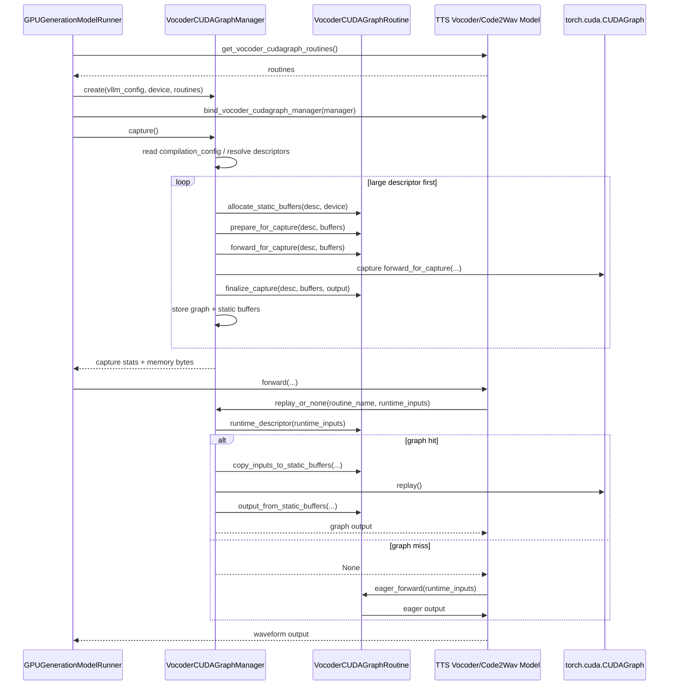
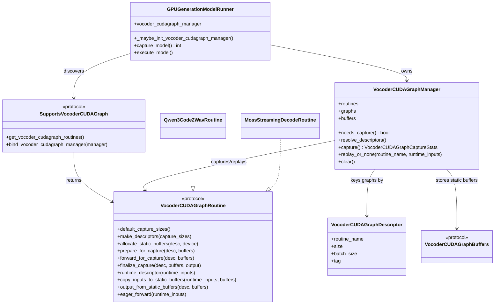

# RFC: Runner-Owned CUDA Graphs for TTS Vocoder and Code2Wav Stages

## Summary

TTS vocoder/code2wav CUDA graphs should be managed by the model runner, following the same ownership model as vLLM's native CUDA graph path.

```text
Runner owns:
  cudagraph_mode / enforce_eager semantics
  cudagraph_capture_sizes
  cudagraph_num_of_warmups
  capture lifecycle
  graph pool
  graph memory accounting
  graph capture/replay stats and logging

Model owns:
  model-specific static buffers
  model-specific capture forward
  runtime input copies into static buffers
  streaming state reset, if any
  eager fallback when graph replay misses
```

The model should not read graph policy from deploy config. It should only expose graphable vocoder routines.

## Current Problems

The current repository has multiple TTS vocoder/code2wav CUDA graph implementations with model-local policy and lifecycle handling.

Examples:

- Qwen3-TTS Code2Wav has model-internal graph wrapper setup and model-local capture size parsing.
- MOSS-TTS codec streaming decode currently creates and warms a CUDA graph wrapper inside the codec/session path.
- Some graph-related fields are placed in `connector.extra`, even though they are stage-local execution policy rather than inter-stage data contract.

This causes several issues:

- `enforce_eager` can be bypassed unless each model manually handles it.
- `cudagraph_capture_sizes` are not consistently read from vLLM's `compilation_config`.
- Graph capture may happen outside the runner `capture_model()` lifecycle.
- Graph memory is invisible to runner-level memory accounting.
- Graph capture logs and failure handling differ by model.
- New TTS vocoder models need to copy model-specific graph wrapper patterns.

The root problem is mixed ownership: model code owns both graph mechanics and graph policy. The final design should split these responsibilities.

## Desired Configuration

Vocoder/code2wav graph policy should use standard vLLM stage config:

```yaml
stages:
  - stage_id: 1
    enforce_eager: false
    compilation_config:
      cudagraph_mode: FULL_DECODE_ONLY
      cudagraph_capture_sizes: [1, 2, 4, 8, 16]
      cudagraph_num_of_warmups: 1
```

For MOSS-TTS Local v1.5, where exact tail chunk hits are useful:

```yaml
stages:
  - stage_id: 1
    enforce_eager: false
    compilation_config:
      cudagraph_capture_sizes: [1, 2, 3, 4, 5, 6, 7, 8, 9, 10, 11, 12, 13, 14, 15]
      cudagraph_num_of_warmups: 1
```

Connector config should only describe inter-stage data contract:

```yaml
connectors:
  shm:
    extra:
      codec_streaming: true
      initial_codec_chunk_frames: 1
      codec_chunk_frames: 15
      codec_left_context_frames: 0
```

The following fields should not exist in connector/model-specific config:

```yaml
decode_cudagraph_capture_sizes
streaming_decode_cudagraph_capture_sizes
streaming_decode_cudagraph_min_free_gb
codec_max_step_frames
```

## High-Level Flow

### Capture and Replay Sequence



### Class Relationship



## New Modules

Add:

```text
vllm_omni/model_executor/models/interfaces/vocoder_cudagraph.py
vllm_omni/worker/vocoder_cudagraph_manager.py
```

The interface module defines model-side protocols and data structures.

The worker module implements the runner-owned graph manager.

## Core Data Structures

### `VocoderCUDAGraphDescriptor`

```python
@dataclass(frozen=True)
class VocoderCUDAGraphDescriptor:
    routine_name: str
    size: int
    batch_size: int | None = None
    tag: str | None = None
```

`size` is intentionally opaque to the runner. For MOSS it means streaming step frames `T`; for Qwen3-TTS it may mean decode window frames. The routine interprets it.

### `VocoderCUDAGraphBuffers`

```python
class VocoderCUDAGraphBuffers(Protocol):
    pass
```

The model routine owns the concrete buffer schema.

Example for MOSS:

```python
@dataclass
class MossStreamingDecodeBuffers:
    codes: torch.Tensor        # [n_vq, stream_slots, T]
    lengths: torch.Tensor      # [stream_slots]
    exec_mask: torch.Tensor    # [stream_slots]
    audio: torch.Tensor | None = None
    audio_lengths: torch.Tensor | None = None
```

Example for Qwen3-TTS:

```python
@dataclass
class Qwen3Code2WavBuffers:
    codes: torch.Tensor
    code_lengths: torch.Tensor
    audio: torch.Tensor | None = None
    audio_lengths: torch.Tensor | None = None
```

### `VocoderCUDAGraphCaptureStats`

```python
@dataclass
class VocoderCUDAGraphCaptureStats:
    requested: list[VocoderCUDAGraphDescriptor]
    captured: list[VocoderCUDAGraphDescriptor]
    failed: list[VocoderCUDAGraphDescriptor]
    elapsed_s: float
    memory_bytes: int
```

The runner logs these stats uniformly.

## Model-Side Interface

### `SupportsVocoderCUDAGraph`

```python
class SupportsVocoderCUDAGraph(Protocol):
    def get_vocoder_cudagraph_routines(
        self,
    ) -> list["VocoderCUDAGraphRoutine"]:
        ...
```

Models do not receive graph policy and do not inspect `enforce_eager` or `compilation_config`.

### `VocoderCUDAGraphRoutine`

```python
class VocoderCUDAGraphRoutine(Protocol):
    name: str

    def default_capture_sizes(self) -> list[int]:
        ...

    def make_descriptors(
        self,
        capture_sizes: list[int],
    ) -> list[VocoderCUDAGraphDescriptor]:
        ...

    def allocate_static_buffers(
        self,
        desc: VocoderCUDAGraphDescriptor,
        device: torch.device,
    ) -> VocoderCUDAGraphBuffers:
        ...

    def prepare_for_capture(
        self,
        desc: VocoderCUDAGraphDescriptor,
        buffers: VocoderCUDAGraphBuffers,
    ) -> None:
        ...

    def forward_for_capture(
        self,
        desc: VocoderCUDAGraphDescriptor,
        buffers: VocoderCUDAGraphBuffers,
    ) -> Any:
        ...

    def finalize_capture(
        self,
        desc: VocoderCUDAGraphDescriptor,
        buffers: VocoderCUDAGraphBuffers,
        output: Any,
    ) -> None:
        ...

    def runtime_descriptor(
        self,
        runtime_inputs: Any,
    ) -> VocoderCUDAGraphDescriptor | None:
        ...

    def copy_inputs_to_static_buffers(
        self,
        runtime_inputs: Any,
        buffers: VocoderCUDAGraphBuffers,
    ) -> None:
        ...

    def output_from_static_buffers(
        self,
        desc: VocoderCUDAGraphDescriptor,
        buffers: VocoderCUDAGraphBuffers,
    ) -> Any:
        ...

    def eager_forward(
        self,
        runtime_inputs: Any,
    ) -> Any:
        ...
```

This is the only model-specific surface. It describes how to allocate, capture, replay, and fallback for one graphable vocoder path.

## Runner-Owned Manager

Add `VocoderCUDAGraphManager`.

```python
class VocoderCUDAGraphManager:
    def __init__(
        self,
        *,
        vllm_config: VllmConfig,
        device: torch.device,
        routines: list[VocoderCUDAGraphRoutine],
    ) -> None:
        self.vllm_config = vllm_config
        self.device = device
        self.routines = {routine.name: routine for routine in routines}
        self.graphs: dict[VocoderCUDAGraphDescriptor, torch.cuda.CUDAGraph] = {}
        self.buffers: dict[VocoderCUDAGraphDescriptor, VocoderCUDAGraphBuffers] = {}
        self.pool = current_platform.get_global_graph_pool()
```

### Capture Decision

```python
def needs_capture(self) -> bool:
    return (
        self.vllm_config.compilation_config.cudagraph_mode != CUDAGraphMode.NONE
        and bool(self.routines)
    )
```

This follows vLLM graph mode. It does not directly check `enforce_eager`.

### Descriptor Resolution

```python
def resolve_descriptors(self) -> list[VocoderCUDAGraphDescriptor]:
    config_sizes = self.vllm_config.compilation_config.cudagraph_capture_sizes
    descriptors = []
    for routine in self.routines.values():
        sizes = config_sizes or routine.default_capture_sizes()
        descriptors.extend(routine.make_descriptors(sizes))
    return sorted(descriptors, key=lambda d: d.size, reverse=True)
```

Large shapes are captured first to match vLLM's graph-pool reuse behavior.

### Capture

```python
@torch.inference_mode()
def capture(self) -> VocoderCUDAGraphCaptureStats:
    if not self.needs_capture():
        return empty_stats()

    descriptors = self.resolve_descriptors()
    start_time = time.perf_counter()

    torch.accelerator.synchronize()
    torch.accelerator.empty_cache()
    start_free = torch.cuda.mem_get_info()[0]

    set_cudagraph_capturing_enabled(True)
    try:
        with graph_capture(device=self.device):
            for desc in descriptors:
                routine = self.routines[desc.routine_name]
                buffers = routine.allocate_static_buffers(desc, self.device)

                for _ in range(self.vllm_config.compilation_config.cudagraph_num_of_warmups):
                    routine.prepare_for_capture(desc, buffers)
                    routine.forward_for_capture(desc, buffers)
                    torch.accelerator.synchronize()

                routine.prepare_for_capture(desc, buffers)
                graph = torch.cuda.CUDAGraph()
                with torch.cuda.graph(graph, pool=self.pool):
                    output = routine.forward_for_capture(desc, buffers)

                routine.finalize_capture(desc, buffers, output)
                self.graphs[desc] = graph
                self.buffers[desc] = buffers
    finally:
        set_cudagraph_capturing_enabled(False)

    torch.accelerator.synchronize()
    end_free = torch.cuda.mem_get_info()[0]

    return VocoderCUDAGraphCaptureStats(
        requested=descriptors,
        captured=list(self.graphs),
        failed=[d for d in descriptors if d not in self.graphs],
        elapsed_s=time.perf_counter() - start_time,
        memory_bytes=start_free - end_free,
    )
```

### Replay

```python
def replay_or_none(
    self,
    routine_name: str,
    runtime_inputs: Any,
) -> Any | None:
    routine = self.routines[routine_name]
    desc = routine.runtime_descriptor(runtime_inputs)
    if desc is None or desc not in self.graphs:
        return None

    buffers = self.buffers[desc]
    routine.copy_inputs_to_static_buffers(runtime_inputs, buffers)
    self.graphs[desc].replay()
    return routine.output_from_static_buffers(desc, buffers)
```

Graph misses fallback to eager in model code.

## Runner Integration

### Initialization

In `GPUGenerationModelRunner`:

```python
self.vocoder_cudagraph_manager: VocoderCUDAGraphManager | None = None
```

After model load:

```python
def _maybe_init_vocoder_cudagraph_manager(self) -> None:
    get_routines = getattr(self.model, "get_vocoder_cudagraph_routines", None)
    if not callable(get_routines):
        return

    routines = get_routines()
    if not routines:
        return

    self.vocoder_cudagraph_manager = VocoderCUDAGraphManager(
        vllm_config=self.vllm_config,
        device=self.device,
        routines=routines,
    )

    bind = getattr(self.model, "bind_vocoder_cudagraph_manager", None)
    if callable(bind):
        bind(self.vocoder_cudagraph_manager)
```

### Capture Lifecycle

In `GPUGenerationModelRunner.capture_model()`:

```python
@torch.inference_mode()
def capture_model(self) -> int:
    graph_memory = super().capture_model()

    if self.vocoder_cudagraph_manager is None:
        return graph_memory

    if not self.vocoder_cudagraph_manager.needs_capture():
        logger.warning(
            "Skipping vocoder CUDA graph capture. "
            "To enable it, ensure cudagraph_mode is not NONE."
        )
        return graph_memory

    stats = self.vocoder_cudagraph_manager.capture()
    logger.info(
        "Vocoder CUDA graph capture finished in %.0f secs, took %.2f GiB, "
        "captured=%s failed=%s",
        stats.elapsed_s,
        stats.memory_bytes / (1 << 30),
        stats.captured,
        stats.failed,
    )
    return graph_memory + stats.memory_bytes
```

### Runtime Forward

Model forward follows a fixed pattern:

```python
output = self._vocoder_cudagraph_manager.replay_or_none(
    "routine_name",
    runtime_inputs,
)
if output is not None:
    return output

return self._routine.eager_forward(runtime_inputs)
```

If graph mode is disabled, no graphs are captured and the path naturally falls back to eager.

## Qwen3-TTS Example

Qwen3-TTS Code2Wav is close to a standard routine:

```text
codec code window -> code2wav decode -> waveform
```

It has no MOSS-style cross-step streaming KV state. The model can expose one routine:

```python
class Qwen3TTSCode2Wav(nn.Module):
    def get_vocoder_cudagraph_routines(self) -> list[VocoderCUDAGraphRoutine]:
        return [
            Qwen3Code2WavCUDAGraphRoutine(
                decoder=self.decoder,
                num_codebooks=self.num_codebooks,
                default_sizes=[25, 73, 97, 169, 325],
            )
        ]

    def bind_vocoder_cudagraph_manager(self, manager) -> None:
        self._vocoder_cudagraph_manager = manager
```

The Qwen3 routine implements:

```python
runtime_descriptor(runtime_inputs)
  -> descriptor(size=runtime_inputs.num_frames)

allocate_static_buffers(desc)
  -> static code tensor and length tensor for desc.size

forward_for_capture(desc, buffers)
  -> decoder.decode(buffers.codes, buffers.code_lengths)

copy_inputs_to_static_buffers(runtime_inputs, buffers)
  -> copy runtime codes and lengths

output_from_static_buffers(desc, buffers)
  -> return captured audio tensors

eager_forward(runtime_inputs)
  -> decoder.decode(runtime_inputs.codes, runtime_inputs.code_lengths)
```

Qwen3-TTS does not own capture sizes, eager policy, graph memory accounting, or graph lifecycle.

## MOSS-TTS Local v1.5 Example

MOSS-TTS Local stage1 is a stateful streaming codec decoder.

Runtime graph input:

```text
codes_step:    [n_vq, stream_slots, T]
codes_lengths: [stream_slots]
exec_mask:     [stream_slots]
```

MOSS-specific semantics:

- `T` is streaming decode step frames.
- The codec has streaming state and per-slot offsets.
- `exec_mask` selects active stream slots.
- Capture must reset streaming state before/after graph capture.
- Generic bucket padding is unsafe because internal offsets advance by tensor `T`.

MOSS exposes a custom routine:

```python
class MossTTSCodecDecoder(nn.Module):
    def get_vocoder_cudagraph_routines(self) -> list[VocoderCUDAGraphRoutine]:
        return [
            MossStreamingDecodeCUDAGraphRoutine(
                codec=self._codec,
                n_vq=self._n_vq,
                stream_slots=self._resolve_stream_slots(),
                default_chunk_frames=self._stream_chunk_frames,
                reset_all_slots=self._reset_all_stream_slots,
            )
        ]

    def bind_vocoder_cudagraph_manager(self, manager) -> None:
        self._vocoder_cudagraph_manager = manager
```

The routine implements:

```python
default_capture_sizes()
  -> list(range(1, default_chunk_frames + 1))

allocate_static_buffers(desc)
  -> codes [n_vq, stream_slots, desc.size]
  -> lengths [stream_slots]
  -> exec_mask [stream_slots]

prepare_for_capture(desc, buffers)
  -> reset all streaming slots
  -> codec._set_streaming_exec_mask(buffers.exec_mask)

forward_for_capture(desc, buffers)
  -> codec._decode_frame(buffers.codes, buffers.lengths)

finalize_capture(desc, buffers, output)
  -> store output audio references
  -> reset all streaming slots

runtime_descriptor(runtime_inputs)
  -> descriptor(size=runtime_inputs.codes_step.shape[-1])

copy_inputs_to_static_buffers(runtime_inputs, buffers)
  -> copy exec_mask, codes_step, codes_lengths
  -> codec._set_streaming_exec_mask(buffers.exec_mask)

eager_forward(runtime_inputs)
  -> codec._set_streaming_exec_mask(runtime_inputs.exec_mask)
  -> codec._decode_frame(runtime_inputs.codes_step, runtime_inputs.codes_lengths)
```

MOSS needs custom static buffers and state reset, but it still does not own runner policy or capture lifecycle.

## Standard Routine for New Models

For new vocoder/code2wav models with ordinary fixed-shape tensor decode, provide a reusable routine:

```python
class StandardCode2WavCUDAGraphRoutine:
    def __init__(
        self,
        *,
        name: str,
        decode_fn: Callable[[Any], Any],
        allocate_buffers_fn: Callable[[VocoderCUDAGraphDescriptor, torch.device], Any],
        copy_inputs_fn: Callable[[Any, Any], None],
        output_fn: Callable[[VocoderCUDAGraphDescriptor, Any], Any],
        runtime_descriptor_fn: Callable[[Any], VocoderCUDAGraphDescriptor | None],
        default_capture_sizes_fn: Callable[[], list[int]],
    ) -> None:
        ...
```

This lets architecture changes with normal decode semantics reuse the same runner flow with minimal model-specific code.

## Final Shape

```text
GPUGenerationModelRunner
  owns policy, capture lifecycle, memory accounting

VocoderCUDAGraphManager
  owns graphs, static buffers, descriptor dispatch, stats

VocoderCUDAGraphRoutine
  owns shape/state-specific mechanics

TTS model
  owns decode math and eager fallback
```

The final architecture removes model-local graph policy, makes TTS vocoder CUDA graphs follow vLLM's runner-owned style, and keeps model-specific customization limited to graph routines.
