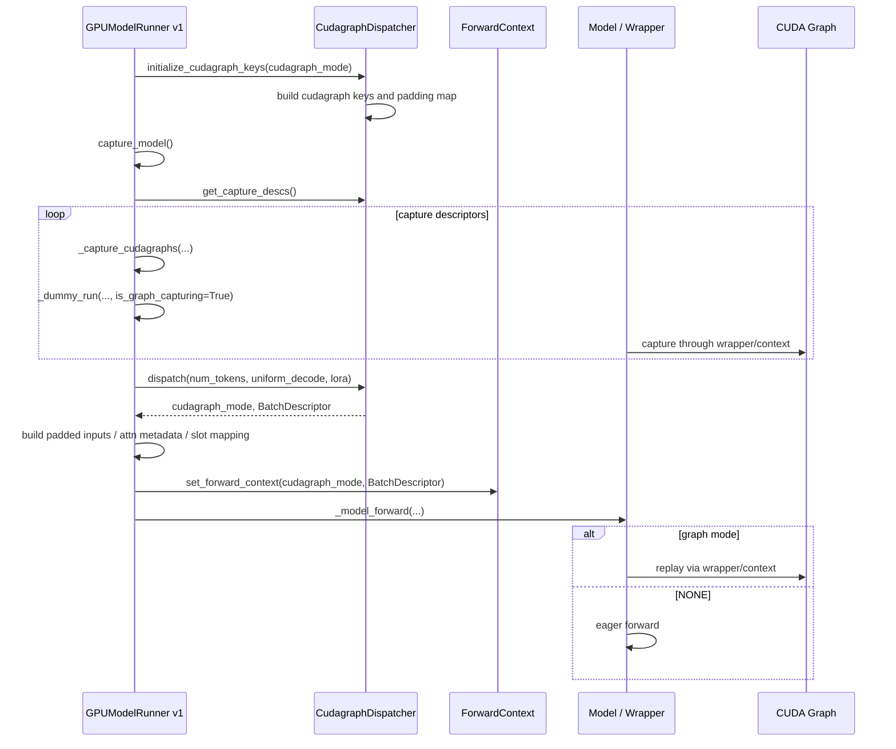
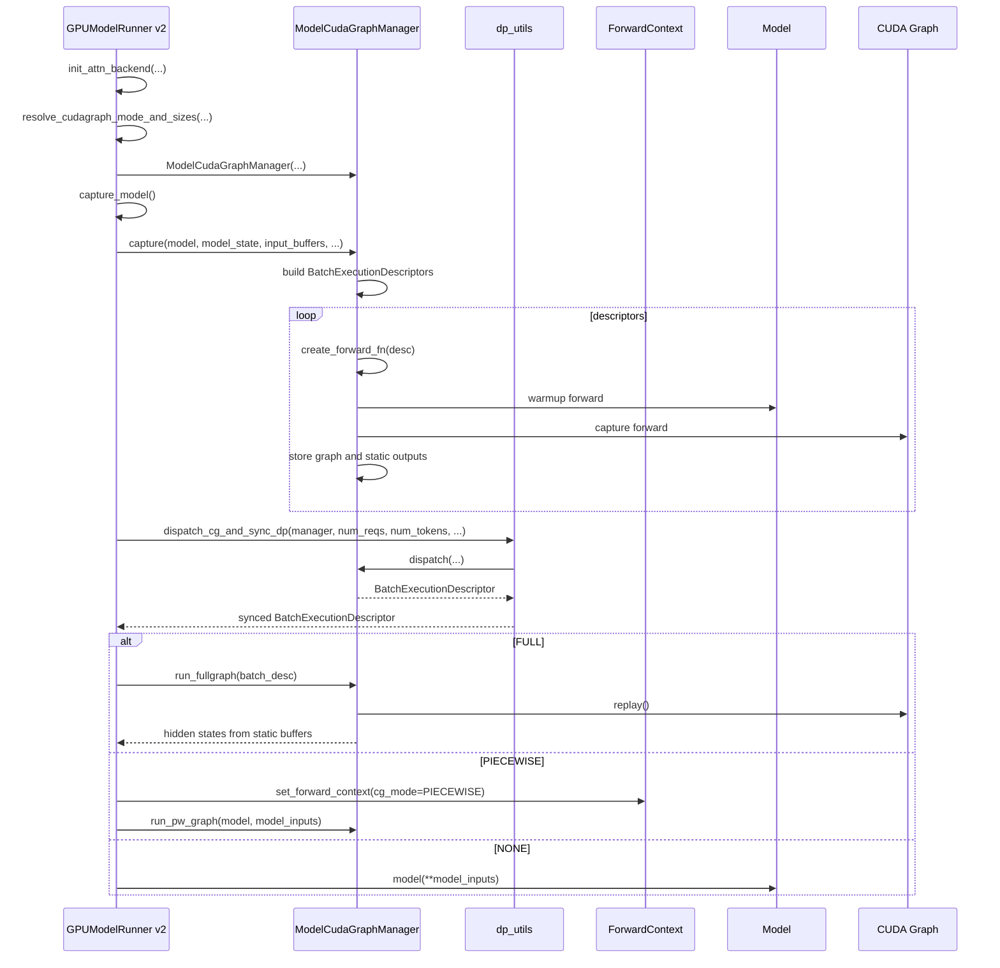

# vLLM CUDA Graph 设计走读：Model Runner v1 与 v2

## 说明

这篇文档同时讲 vLLM 当前仓库里的两套 model runner CUDA graph 路径：

```text
Model Runner v1:
  /root/vllm-omni-workspace/vllm/vllm/v1/worker/gpu_model_runner.py
  /root/vllm-omni-workspace/vllm/vllm/v1/cudagraph_dispatcher.py

Model Runner v2:
  /root/vllm-omni-workspace/vllm/vllm/v1/worker/gpu/model_runner.py
  /root/vllm-omni-workspace/vllm/vllm/v1/worker/gpu/cudagraph_utils.py
  /root/vllm-omni-workspace/vllm/vllm/v1/worker/gpu/dp_utils.py
```

这里的 “v1/v2” 是本文为了区分两套 runner 结构使用的名字。两者都在 `vllm/v1/worker` 目录下。

## 核心目标

vLLM CUDA graph 的目标是把高频、shape 可枚举的模型 forward 路径提前 capture 成 CUDA graph，运行时通过 graph replay 减少 Python 调度和 kernel launch 开销。

它不是简单地把任意 `model.forward()` 包进 `torch.cuda.graph()`。vLLM 需要处理：

```text
scheduler batch shape
padding
attention metadata
KV cache slot mapping
LoRA cases
spec decode
data parallel 同步
prefill/decode 差异
FULL / PIECEWISE graph mode
```

共同的 high-level flow 是：

```text
config 解析 cudagraph_mode / cudagraph_capture_sizes
runner 在 capture_model() 生命周期里 capture graphs
runtime 根据当前 batch dispatch 到某个 graph descriptor
命中 graph 时 replay
miss 或不支持时 eager / non-graph fallback
```

## 共同配置

两套 runner 都依赖 `CompilationConfig`：

```python
compilation_config.cudagraph_mode
compilation_config.cudagraph_capture_sizes
compilation_config.max_cudagraph_capture_size
compilation_config.cudagraph_num_of_warmups
compilation_config.cudagraph_specialize_lora
```

如果用户显式配置：

```yaml
compilation_config:
  cudagraph_capture_sizes: [1, 2, 4, 8, 16]
```

vLLM 会去重、排序、过滤非法 size。

如果用户不配置，vLLM 会生成默认列表，大致是：

```text
[1, 2, 4]
+ multiples of 8 up to 256
+ multiples of 16 above 256
```

同时受这些条件限制：

```text
model_config.enforce_eager
compilation_config.cudagraph_mode
max_cudagraph_capture_size
max_num_batched_tokens
max_num_seqs
num_speculative_tokens
tensor parallel / sequence parallel
performance_mode
```

如果 graph 被禁用，最终会变成：

```python
compilation_config.max_cudagraph_capture_size = 0
compilation_config.cudagraph_capture_sizes = []
```

所以模型代码不应该自己读 `enforce_eager` 来决定 graph policy，而应尊重解析后的 graph mode / capture sizes。

## 共同概念

### `CUDAGraphMode`

常见 mode：

```text
NONE
PIECEWISE
FULL
FULL_DECODE_ONLY
```

语义：

- `NONE`: 不使用 CUDA graph。
- `PIECEWISE`: 只对 graph-safe partition 使用 CUDA graph。
- `FULL`: capture 整个 forward。
- `FULL_DECODE_ONLY`: 只在 decode routine 上使用 full graph。

### Graph Size 与 Padding

runtime batch 不一定正好等于 capture size，所以 vLLM 会把 runtime size pad 到某个 captured size。

例如：

```text
capture sizes = [1, 2, 4, 8, 16]
runtime num_tokens = 6
selected graph size = 8
```

vLLM 的 padding 是语义安全的，因为 runner 同步构造了：

```text
padded input tensors
padded attention metadata
padded slot mapping
padded BatchDescriptor / BatchExecutionDescriptor
```

KV cache slot mapping 里的 padding token 会填无效 slot，例如 `-1`，避免 padding 写入有效 KV cache。

这是主模型 CUDA graph 能安全 pad 的关键。

## Model Runner v1

### 文件

```text
vllm/vllm/v1/worker/gpu_model_runner.py
vllm/vllm/v1/cudagraph_dispatcher.py
```

### 总体结构

v1 的设计是分散式的：

```text
CudagraphDispatcher:
  根据 runtime batch 选择 cudagraph_mode 和 padded BatchDescriptor

GPUModelRunner:
  准备 padded inputs / attention metadata / slot mapping
  在 capture_model() 中触发 capture
  runtime 用 set_forward_context 传递 graph mode 和 descriptor

compiled wrapper / cudagraph wrapper:
  从 forward context 读取 runtime mode
  决定 replay graph 或 eager fallback
```

也就是说，v1 的 replay 决策很依赖 `forward_context`。

### v1 时序图



### v1 `CudagraphDispatcher`

`CudagraphDispatcher` 是 runtime graph 选择器。

它维护：

```python
cudagraph_keys: dict[CUDAGraphMode, set[BatchDescriptor]]
_bs_to_padded_graph_size
```

核心方法：

```python
initialize_cudagraph_keys(...)
dispatch(...)
get_capture_descs()
```

`initialize_cudagraph_keys()` 会根据：

```text
cudagraph_mode
cudagraph_capture_sizes
uniform_decode_query_len
max_num_seqs
LoRA cases
```

生成可以被 runtime dispatch 的 `BatchDescriptor`。

`dispatch()` 输入 runtime batch 条件：

```python
num_tokens
uniform_decode
has_lora
num_active_loras
valid_modes
invalid_modes
```

输出：

```python
cudagraph_mode, batch_descriptor
```

如果没有命中 graph，返回：

```python
CUDAGraphMode.NONE, BatchDescriptor(num_tokens)
```

### v1 Runtime

v1 runtime 在 `GPUModelRunner.execute_model()` 里：

```python
cudagraph_mode, batch_desc, should_ubatch, num_tokens_across_dp, cudagraph_stats = (
    self._determine_batch_execution_and_padding(...)
)
```

然后 runner 根据 `batch_desc` 准备：

```text
num_tokens_padded
num_reqs_padded
slot_mappings
attention metadata
input_ids / positions / inputs_embeds
```

最后通过：

```python
set_forward_context(
    attn_metadata,
    vllm_config,
    num_tokens=num_tokens_padded,
    cudagraph_runtime_mode=cudagraph_mode,
    batch_descriptor=batch_desc,
    slot_mapping=slot_mappings,
)
```

把 graph runtime state 传给模型/wrapper。

v1 的重点是：

```text
runner dispatch
runner set forward context
wrapper 通过 context replay
```

### v1 Capture

v1 `capture_model()` 中：

```python
if compilation_config.cudagraph_mode == CUDAGraphMode.NONE:
    return 0

set_cudagraph_capturing_enabled(True)
with graph_capture(device=self.device):
    start_free = torch.cuda.mem_get_info()[0]
    for runtime_mode, batch_descs in cudagraph_dispatcher.get_capture_descs():
        self._capture_cudagraphs(batch_descs, runtime_mode)
    end_free = torch.cuda.mem_get_info()[0]
set_cudagraph_capturing_enabled(False)
```

`_capture_cudagraphs()` 内部会跑 dummy run，并通过 forward context / wrapper 触发 capture。

### v1 特点

优点：

```text
Dispatcher 和原 runner 逻辑结合紧密
forward_context 能复用已有 compiled wrapper 机制
支持 FULL / PIECEWISE / LoRA / DP 等复杂场景
```

缺点：

```text
graph dispatch、capture、replay 分散在 dispatcher、runner、wrapper、forward context
runtime 路径较绕
FULL graph replay 不是 runner 显式调用的单一 manager 方法
扩展额外 graph manager 时边界不够清楚
```

## Model Runner v2

### 文件

```text
vllm/vllm/v1/worker/gpu/model_runner.py
vllm/vllm/v1/worker/gpu/cudagraph_utils.py
vllm/vllm/v1/worker/gpu/dp_utils.py
```

### 总体结构

v2 把 CUDA graph 逻辑收敛到 `ModelCudaGraphManager`。

核心结构：

```text
GPUModelRunner:
  持有 self.cudagraph_manager
  初始化时根据 attention backend support resolve cudagraph mode
  capture_model() 调 cudagraph_manager.capture(...)
  runtime 显式调用 run_fullgraph / run_pw_graph / eager

ModelCudaGraphManager:
  维护 capture descriptors
  持有 graphs
  持有 static output buffers
  管 dispatch
  管 FULL graph replay
  管 PIECEWISE graph runner
```

v2 的关键变化是：graph manager 成为更明确的 owner。

### v2 时序图



### v2 初始化

v2 在 runner 初始化 attention backend 后：

```python
cudagraph_mode = self.compilation_config.resolve_cudagraph_mode_and_sizes(
    attn_cg_support.min_cg_support,
    attn_cg_support.min_cg_attn_backend,
    self.decode_query_len,
    self.parallel_config.tensor_parallel_size,
    self.kv_cache_config,
    self.max_num_reqs,
)

self.cudagraph_manager = ModelCudaGraphManager(
    self.vllm_config,
    self.device,
    cudagraph_mode,
    decode_query_len=self.decode_query_len,
    lora_capture_cases=self.lora_capture_cases,
)
```

这比 v1 更明确：attention backend support 参与决定最终 graph mode，然后 manager 基于这个 mode 管所有 graph。

### v2 Descriptor

v2 使用 `BatchExecutionDescriptor` 作为 graph key。

相比 v1 `BatchDescriptor`，它更接近“graph execution case”：

```text
cg_mode
num_tokens
num_reqs
uniform_token_count
num_active_loras
```

它既描述 runtime batch，也描述 graph replay case。

### v2 Capture

v2 `GPUModelRunner.capture_model()`：

```python
assert self.cudagraph_manager is not None
if not self.cudagraph_manager.needs_capture():
    return 0

start_free = torch.cuda.mem_get_info()[0]
attn_states = self.cudagraph_manager.capture(
    self.model,
    self.model_state,
    self.input_buffers,
    self.intermediate_tensors,
    self.block_tables,
    self.attn_groups,
    self.kv_cache_config,
    ...
)
end_free = torch.cuda.mem_get_info()[0]
return start_free - end_free
```

`ModelCudaGraphManager.capture()` 内部构造 `create_forward_fn(desc, warmup)`。

这个 closure 负责：

```text
构造 dummy model_inputs
构造 attention metadata / slot mapping
设置 LoRA capture state
set_forward_context(...)
调用 model 或 run_pw_graph
保存 hidden_states / intermediate_tensors 到 static output buffers
```

FULL graph capture 时，manager 自己创建：

```python
graph = torch.cuda.CUDAGraph()
with torch.cuda.graph(graph, self.pool):
    forward_fn(CUDAGraphMode.NONE)
self.graphs[desc] = graph
```

### v2 Runtime

v2 runtime 在 `execute_model()` 里更直接。

先 dispatch：

```python
batch_desc, num_tokens_across_dp = dispatch_cg_and_sync_dp(
    self.cudagraph_manager,
    num_reqs,
    num_toks,
    uniform_tok_count,
    self.dp_size,
    self.dp_rank,
    need_eager=is_profile or skip_compiled,
    num_active_loras=num_active_loras,
)
```

然后准备 inputs / attention metadata。

最后显式分支：

```python
if batch_desc.cg_mode == CUDAGraphMode.FULL:
    model_output = self.cudagraph_manager.run_fullgraph(batch_desc)
elif batch_desc.cg_mode == CUDAGraphMode.PIECEWISE:
    model_output = self.cudagraph_manager.run_pw_graph(self.model, model_inputs)
else:
    model_output = self.model(**model_inputs)
```

这比 v1 更清晰：FULL graph replay 是 manager 的显式方法。

### v2 DP Sync

v2 把 DP graph 协调抽到：

```text
vllm/vllm/v1/worker/gpu/dp_utils.py
```

核心函数：

```python
dispatch_cg_and_sync_dp(...)
sync_cudagraph_and_dp_padding(...)
```

逻辑：

1. 本 rank 先根据当前 batch dispatch 出 desired descriptor。
2. 所有 DP ranks all-reduce：

   ```text
   num_tokens
   cg_mode
   uniform_token_count
   ```

3. 如果任意 rank 要 eager，则所有 rank eager。
4. 否则取跨 rank 最大 token 数，重新 dispatch 到统一 graph descriptor。
5. 返回 synced descriptor 和 `num_tokens_across_dp`。

这比 v1 里 runner 内部处理 DP padding 更模块化。

### v2 FULL Graph Output

v2 manager 不只是 replay graph，还持有 captured output buffers。

FULL graph replay：

```python
super().run_fullgraph(desc)
return self.hidden_states[: desc.num_tokens]
```

非最后 PP rank 则返回：

```python
self.intermediate_tensors[: desc.num_tokens]
```

也就是说，v2 manager 负责：

```text
graph replay
static output buffer 管理
output slicing
```

## v2 相比 v1 的主要区别

### 1. Graph owner 更集中

v1：

```text
CudagraphDispatcher owns dispatch keys
GPUModelRunner owns capture loop
forward_context carries runtime graph state
wrapper owns replay behavior
```

v2：

```text
ModelCudaGraphManager owns descriptors, graphs, static outputs, dispatch, replay
GPUModelRunner explicitly calls manager
```

这是最核心的区别。

### 2. Runtime replay 更显式

v1：

```python
set_forward_context(..., cudagraph_runtime_mode, batch_descriptor)
model_output = self._model_forward(...)
```

graph replay 隐藏在 model/wrapper/compiled path 里。

v2：

```python
if FULL:
    model_output = self.cudagraph_manager.run_fullgraph(batch_desc)
elif PIECEWISE:
    model_output = self.cudagraph_manager.run_pw_graph(model, model_inputs)
else:
    model_output = model(**model_inputs)
```

runner 一眼能看出当前走哪条路径。

### 3. Descriptor 更 graph-centric

v1 `BatchDescriptor` 更像 forward context 的 batch 描述。

v2 `BatchExecutionDescriptor` 更像 graph manager 的 execution key。

它把 `cg_mode` 纳入 descriptor，使 graph key 和 runtime mode 更绑定。

### 4. Capture closure 更模块化

v1 capture 更依赖 `_dummy_run()` 和 forward context。

v2 manager 里有 `create_forward_fn(desc, warmup)`：

```text
准备 dummy inputs
准备 attention metadata
设置 forward context
执行 model forward
保存 static outputs
```

这个 closure 是 manager capture 的核心抽象点。

### 5. DP 协调独立化

v1 DP 逻辑在 runner 的 `_determine_batch_execution_and_padding()` 中。

v2 抽成：

```python
dispatch_cg_and_sync_dp(...)
sync_cudagraph_and_dp_padding(...)
```

更容易复用，也更容易为其他 graph manager 设计类似 DP sync。

### 6. Attention backend support 更早参与 graph mode resolve

v2 初始化 attention backend 后，用 backend support 来 resolve graph mode：

```python
resolve_cudagraph_mode_and_sizes(attn_cg_support, ...)
```

这比 v1 更清晰地把 “backend 是否支持 FULL/PIECEWISE” 纳入 manager 初始化。

### 7. 更适合扩展子 graph manager

v2 已经呈现出 manager-owned graph 的模式：

```text
runner owns lifecycle
manager owns descriptors/graphs/replay
model supplies forward computation
```

这对 TTS vocoder/code2wav CUDA graph 很重要。我们设计 `VocoderCUDAGraphManager` 时，应该更像 v2，而不是 v1。

## 对 TTS Vocoder Graph 设计的启发

如果我们要设计 TTS vocoder/code2wav graph，应该 follow v2：

```text
GPUGenerationModelRunner:
  owns lifecycle
  calls vocoder_cudagraph_manager.capture()
  runtime calls replay_or_none()

VocoderCUDAGraphManager:
  owns descriptors, graphs, static buffers, stats, replay dispatch

VocoderCUDAGraphRoutine:
  model-specific shape/state mechanics
```

不要 follow v1 的这种隐式结构：

```text
custom dispatcher + forward_context + model wrapper hidden replay
```

TTS vocoder graph target 不是标准 LLM forward：

```text
LLM graph:
  input_ids / positions / attention metadata / KV cache -> hidden states/logits

TTS vocoder graph:
  codec codes / lengths / exec_mask / vocoder state -> waveform
```

所以 TTS 需要自己的 routine abstraction；但大的生命周期、配置、memory accounting 应该 follow v2 的 runner + manager pattern。

## 总结

v1 和 v2 都遵循 vLLM CUDA graph 的大原则：

```text
config controls graph policy
runner controls capture lifecycle
runtime dispatch chooses graph or eager
padding maps dynamic runtime shape to captured static shape
```

但 v2 把 graph 相关职责收敛得更清楚：

```text
v1:
  Dispatcher + Runner + ForwardContext + Wrapper

v2:
  Runner + ModelCudaGraphManager + explicit run_fullgraph/run_pw_graph
```

因此，新的 TTS vocoder/code2wav CUDA graph 设计应以 v2 为参考。
