# MOSS-TTS 模型架构梳理：从文本到 RVQ 声码器

日期：2026-06-22

本文基于本地 `vllm-omni` 与 `sglang-omni` 中的 MOSS-TTS 实现，梳理 MOSS-TTS 的核心架构、关键张量 shape、delay pattern 如何组织 32 个音频 codebook，以及 MOSS-TTS-Realtime 的 local transformer 与 delay-pattern 版本有什么不同。

为了便于阅读，下文主要讨论两条架构线：

- **MOSS-TTS Delay / MOSS-TTS-v1.5**：Qwen3 backbone 一次预测文本流和多路 RVQ 音频流，使用 delay pattern 组织音频 codebook。
- **MOSS-TTS-Realtime**：Qwen3 backbone 负责时间步推进，每个音频 frame 内部再用一个小型 local transformer 自回归地产生 RVQ codebook。

## 1. 总览：MOSS-TTS 在生成什么？

TTS 模型的最终目标是 waveform，但 MOSS-TTS 不直接预测波形。它先预测离散音频 token，也就是 MOSS Audio Tokenizer 的 RVQ code，然后由 codec/vocoder 解码成 24 kHz 音频。

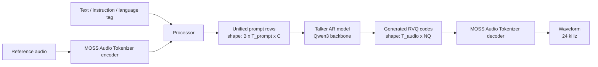

这里有两个关键概念：

- **Talker**：语言模型式的自回归生成器，预测文本控制 token 和音频 code。
- **Audio Tokenizer / Codec**：把 waveform 编码为 RVQ code，或把 RVQ code 解码回 waveform。

MOSS-TTS-v1.5 的核心规格如下：

| 项 | 值 |
|---|---|
| 主架构 | `MossTTSDelayModel` |
| Backbone | Qwen3-8B decoder-only Transformer |
| Hidden size | 4096（v1.5 Qwen3-8B 配置） |
| Audio RVQ codebook 数 | `n_vq = 32` |
| Audio codebook size | `audio_vocab_size = 1024` |
| Audio pad code | `1024` |
| 输出采样率 | 24 kHz |
| 主输出 | `(T_audio, 32)` 离散音频 code，再解码成 waveform |

## 2. Pipeline 层：三阶段概念 vs vLLM-Omni 两阶段实现

从概念上看，MOSS-TTS 可以拆成三段：

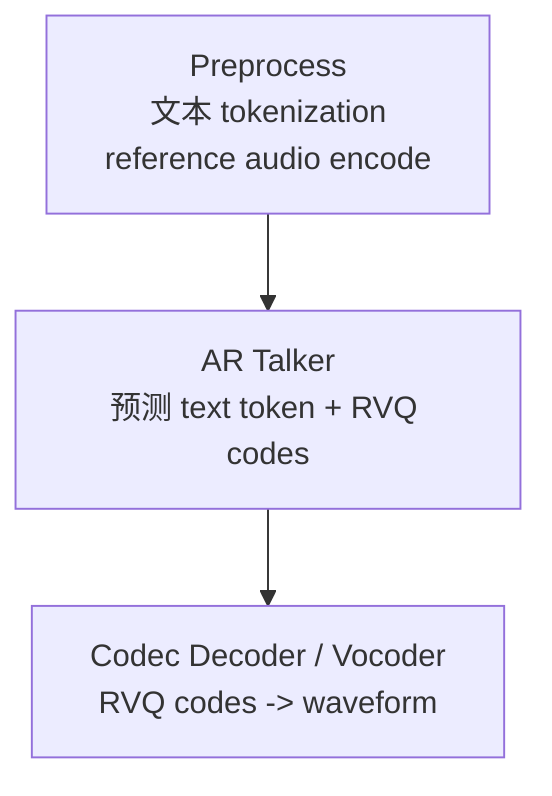

在 `sglang-omni` 中，MOSS-TTS Delay pipeline 就是：

```text
preprocessing -> tts_engine -> vocoder
```

而本地 `vllm-omni` 的 full MOSS-TTS family 实现为两个模型 stage：

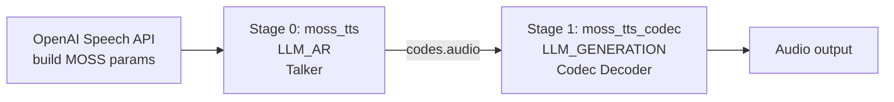

差异在于：vLLM-Omni 当前把 reference audio encode 放在 API server 构造请求参数时完成，而不是独立建一个 pipeline stage。

## 3. Processor：把文本和参考音频整理成 unified rows

MOSS-TTS 的 processor 会把用户文本、参考音频 code、特殊控制 token 组合成一个二维 row 序列。

在 `sglang-omni` 里，processor 输出：

```python
input_rows = batch["input_ids"]  # shape: [1, T_prompt, C]
prompt_rows = input_rows[0]      # shape: [T_prompt, C]
```

其中：

- `B = 1`：单条请求。
- `T_prompt`：prompt row 数，包含文本、控制 token、reference audio 对齐区域。
- `C = 1 + n_vq`。
- 第 0 列是 text/special token。
- 第 1 到 `n_vq` 列是 audio RVQ code grid。

对 MOSS-TTS-v1.5：

```text
prompt_rows.shape = [T_prompt, 33]
column 0          = text token / special token
column 1..32      = reference audio codebook columns
```

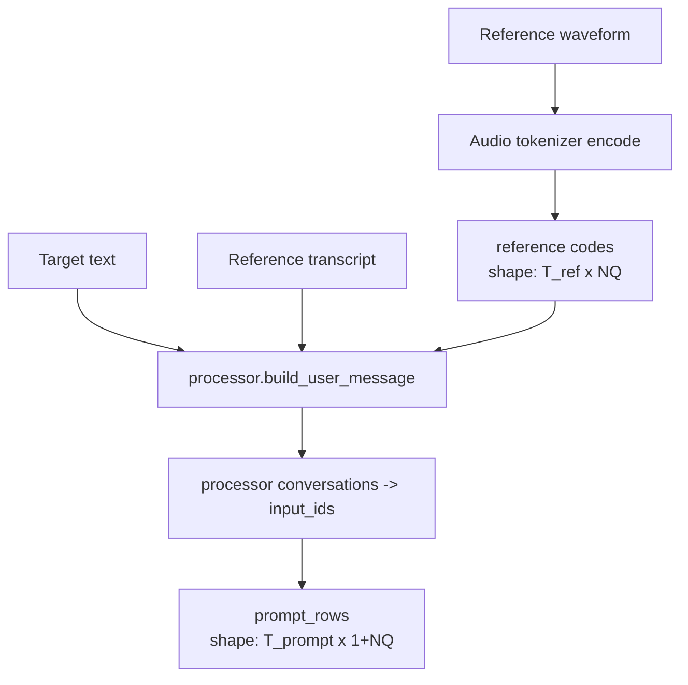

可以把 `prompt_rows` 想成这样：

```text
row t:
[
  text_or_special_id,    # scalar
  audio_codebook_0,      # scalar, 0..1023 or pad=1024
  audio_codebook_1,
  ...
  audio_codebook_31
]
```

大部分纯文本 row 的 audio 列是 `audio_pad_code = 1024`。reference audio 所在 row 会有真实 audio code，用于给 talker 提供说话人音色和语音风格上下文。

## 4. Delay Talker：一个 Qwen3 backbone，多头输出

MOSS-TTS Delay 的核心是：

```text
text embedding + audio codebook embeddings -> Qwen3 backbone -> parallel heads
```

更具体地说，它有：

- 一个 Qwen3 decoder-only backbone。
- 一个 text LM head，预测文本 token。
- `n_vq` 个 audio LM head，每个 head 预测一个 RVQ codebook。
- `n_vq` 个 audio embedding table，每个 codebook 一个 embedding。

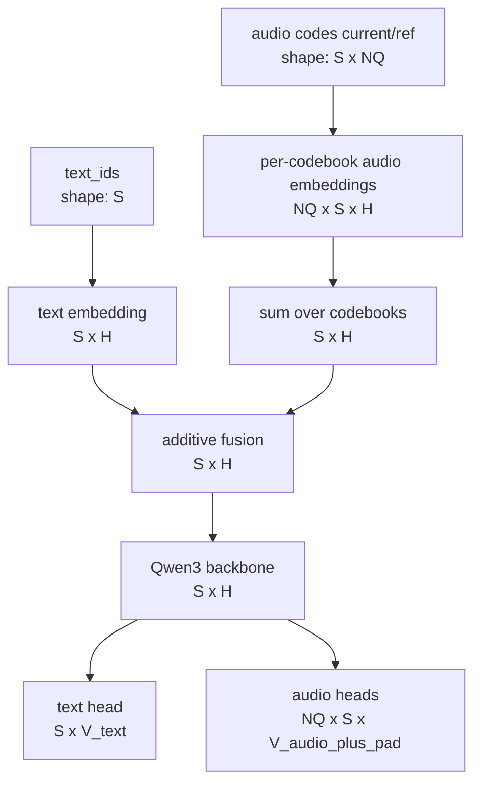

符号说明：

| 符号 | 含义 | MOSS-TTS-v1.5 常见值 |
|---|---|---|
| `S` | 当前 forward 的 token/row 数 | prefill 为 prompt chunk 长度；decode 常为 1 |
| `H` | hidden size | 4096 |
| `NQ` | RVQ codebook 数 | 32 |
| `V_text` | Qwen3 text vocab size | 约 151k，依 checkpoint |
| `V_audio` | audio codebook size | 1024 |
| `V_audio_plus_pad` | audio head 输出维度 | 1025，包含 pad code |

### 4.1 输入 embedding 的 shape

Delay talker 的输入不是简单的文本 embedding。它做的是 additive fusion：

```text
input_embed[t] =
    text_embed[text_id[t]]
  + sum_i audio_embed_i[audio_code[t, i]]
```

对应 shape：

```text
text_ids:        [S]
text_embed:      [S, H]
audio_codes:     [S, NQ]
audio_embed_i:   [S, H]      # 第 i 个 codebook 的 embedding
audio_sum:       [S, H]
input_embeds:    [S, H]
```

vLLM-Omni 中为了减少 Python loop，会把 audio embedding 权重 stack 起来：

```text
_stacked_audio_emb_w.shape = [NQ, V_audio + 1, H]
```

如果 `codes.shape = [S, NQ]`，实现上可以转置成：

```text
codes_t.shape = [NQ, S]
gather(_stacked_audio_emb_w, codes_t).shape = [NQ, S, H]
sum(dim=0).shape = [S, H]
```

### 4.2 输出 head 的 shape

Qwen3 backbone 输出：

```text
hidden_states.shape = [S, H]
```

然后分两类 head：

```text
text_logits = text_lm_head(hidden_states)
text_logits.shape = [S, V_text]

audio_logits_i = audio_head_i(last_hidden)
audio_logits_i.shape = [V_audio + 1]
```

vLLM-Omni 同样把 audio heads 权重 stack：

```text
_stacked_audio_head_w.shape = [NQ, V_audio + 1, H]
last_h.shape                = [H]
all_audio_logits.shape      = [NQ, V_audio + 1]
```

对 MOSS-TTS-v1.5：

```text
_stacked_audio_head_w.shape = [32, 1025, 4096]
last_h.shape                = [4096]
all_audio_logits.shape      = [32, 1025]
```

其中 `1024` 是 pad code。采样真实 audio code 时，pad code 和非法 sentinel 会被 mask 掉。

## 5. Delay Pattern：为什么不是每一步直接生成完整 frame？

RVQ 音频有多个 codebook。一个 audio frame 需要 32 个 code：

```text
frame[t] = [c0[t], c1[t], c2[t], ..., c31[t]]
```

如果在一个 AR step 内顺序生成 32 个 codebook，会增加每个 frame 的内部自回归深度。MOSS-TTS Delay 使用 delay pattern：不同 codebook 以不同延迟出现在时间轴上。

简化到 4 个 codebook 时，delay pattern 大致如下：

```text
AR step       cb0      cb1      cb2      cb3
----------------------------------------------
0            c0[0]    pad      pad      pad
1            c0[1]    c1[0]    pad      pad
2            c0[2]    c1[1]    c2[0]    pad
3            c0[3]    c1[2]    c2[1]    c3[0]   -> frame 0 complete
4            c0[4]    c1[3]    c2[2]    c3[1]   -> frame 1 complete
```

Mermaid 版本：

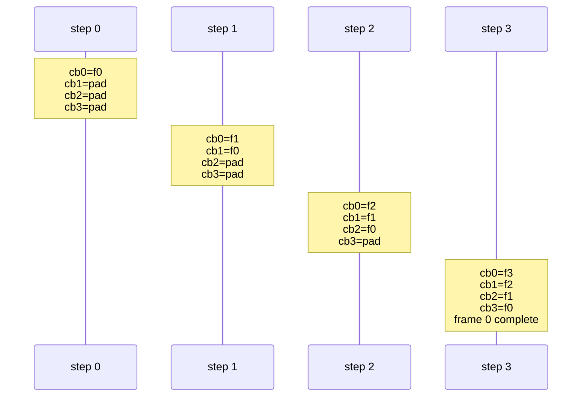

对 `NQ = 32`，第一个完整 frame 需要等到第 31 个延迟步后才齐全。模型生成出的 delayed rows shape 是：

```text
delayed_audio_codes.shape = [T_delayed, NQ]
```

de-delay 后变成：

```text
audio_codes.shape = [T_audio, NQ]
T_audio ~= T_delayed - NQ + 1
```

本地实现中的 de-delay 逻辑可以概括为：

```python
for i in range(nq):
    de_delayed[:, i] = delayed[i : i + T_audio, i]
```

也就是第 `i` 个 codebook 向左平移 `i` 个 step。

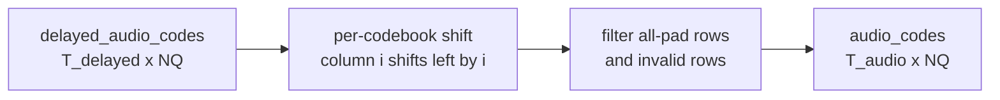

## 6. 一次 decode step 内部发生了什么？

Delay talker 每个 decode step 的关键状态包括：

| 状态 | 含义 |
|---|---|
| `audio_lengths` | 当前音频模式中已经走过多少 audio-bearing token |
| `delayed_lengths` | delay-slot 后已经处在第几个 delay step |
| `is_audio` | 当前是否处于 audio generation mode |
| `audio_codes.current` | 上一步采样出的 `[NQ]` audio code |
| `audio_codes.accumulated` | 已生成的 delayed rows，shape `[T_so_far, NQ]` |

单步流程：

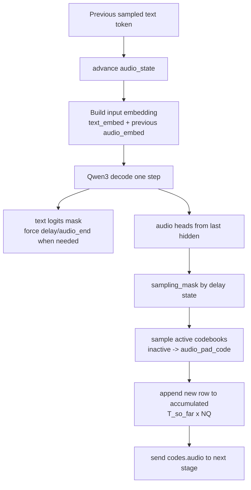

关键 shape：

```text
input_ids.shape              = [1]
previous_audio_codes.shape   = [NQ]
input_embeds.shape           = [1, H]
hidden.shape                 = [1, H]
last_h.shape                 = [H]
all_audio_logits.shape       = [NQ, V_audio + 1]
new_codes.shape              = [NQ]
accumulated.shape            = [T_so_far, NQ]
```

对 v1.5：

```text
previous_audio_codes.shape = [32]
input_embeds.shape         = [1, 4096]
all_audio_logits.shape     = [32, 1025]
new_codes.shape            = [32]
```

## 7. Text token 与 audio code 是怎么协同停止的？

MOSS-TTS Delay 仍然由 text head 驱动 AR scheduler。audio head 采样是在 `make_omni_output()` 中从同一个 hidden state 派生出来。

关键 text special token：

| Token | 默认 ID | 作用 |
|---|---:|---|
| `<|im_end|>` | 151645 | 结束整个 AR loop |
| `audio_start` | 151652 | 进入音频生成 |
| `audio_end` | 151653 | 退出音频生成 |
| `audio_assistant_gen_slot` | 151656 | 音频生成 slot |
| `audio_assistant_delay_slot` | 151662 | 触发 delay pattern 的 slot |

text logits 会根据 `audio_state` 被强制或 mask：

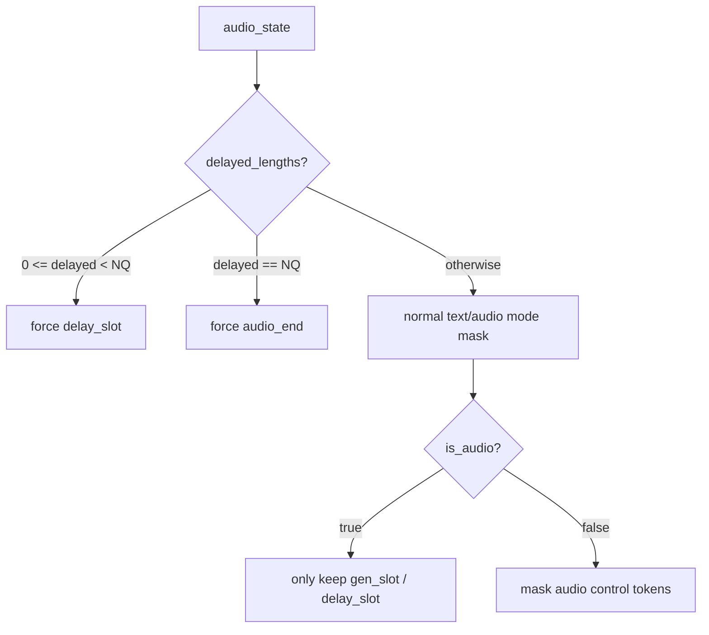

这保证了文本流和音频流保持一个合法的协议，而不是任意混杂。

## 8. Codec：RVQ code 到 waveform

MOSS Audio Tokenizer 既能 encode reference audio，也能 decode generated code。

### 8.1 Encode reference audio

reference waveform 进入 codec encoder：

```text
wav_list: list[tensor]
each wav.shape = [T_wav] or [1, T_wav]

batch_encode(wav_list):
    x.shape       = [B, 1, T_max]
    lengths.shape = [B]
    audio_codes.shape = [NQ, B, T_code]
```

vLLM-Omni 在 serving 构参时会把 reference encode 成 codes，再传给 processor / prompt：

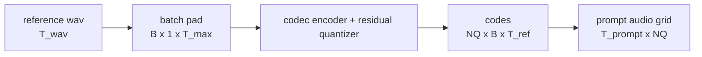

### 8.2 Decode generated audio codes

codec decoder 输入是 codebook-major：

```text
codes_nq_t.shape = [NQ, T_audio]
```

`batch_decode()` 会组 batch：

```text
codes_list: list of [NQ, T_i]
B = len(codes_list)
max_t = max(T_i)

codes.shape   = [NQ, B, max_t]
lengths.shape = [B]
audio.shape   = [B, 1, T_wav]
```

整体路径：

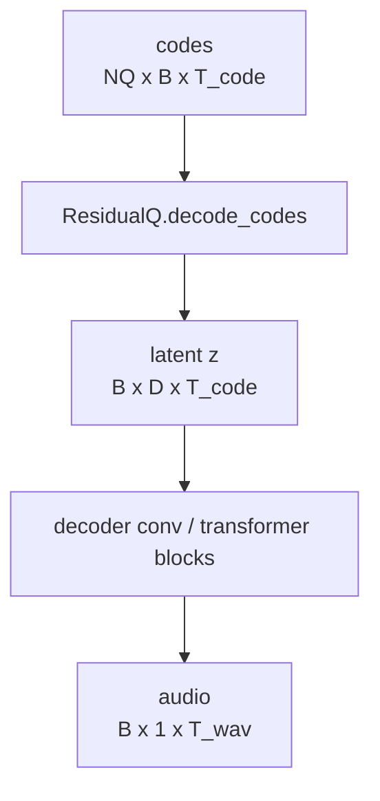

对 vLLM-Omni stage 1，Stage 0 会把：

```text
audio_codes.shape = [T_audio, NQ]
```

转成：

```text
codes_nq_t.shape = [NQ, T_audio]
flat.shape       = [NQ * T_audio]
```

Stage 1 再 reshape 回 `[NQ, T_audio]` 后调用 codec decoder。

## 9. MOSS-TTS-Realtime：local transformer 版本

MOSS-TTS-Realtime 的目标是低首包延迟。它不采用 v1.5 delay-pattern 的 32-codebook 设计，而是：

- outer Qwen3 backbone 推进时间步。
- 每个时间步生成一个 audio frame。
- frame 内部的 `rvq = 16` 个 codebook 由一个 4 层 local transformer 自回归地产生。

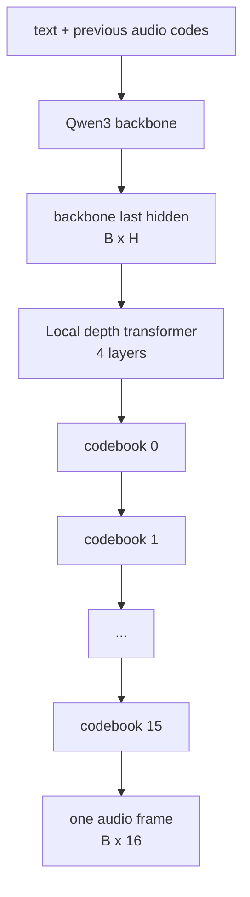

Local transformer 的配置：

| 项 | 值 |
|---|---:|
| hidden size | 2048 |
| layers | 4 |
| attention heads | 16 |
| KV heads | 8 |
| intermediate size | 6144 |
| RVQ codebooks | 16 |
| local max position | 33 |
| audio vocab size | 1027 |

单个 frame 的生成过程：

```text
backbone_last_hidden.shape = [B, H]
embeds.shape               = [B, rvq, H]
codes.shape                = [B, rvq]
```

第 0 个位置直接使用 backbone hidden：

```text
embeds[:, 0, :] = backbone_last_hidden
```

第 `s > 0` 个位置使用上一个 codebook 的 token embedding：

```text
embeds[:, s, :] = codec_embedding[s-1](codes[:, s-1])
```

每个 codebook step 都重新跑一个长度为 `s+1` 的 causal local transformer：

```text
seq_len = s + 1
hidden = local_transformer(embeds[:, :seq_len, :], pos_ids[:, :seq_len])
logits = local_lm_heads[s](hidden[:, s, :])
codes[:, s] = sample(logits)
```

Mermaid 展开：

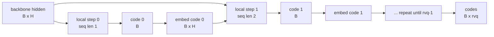

这和 Delay 版本的差异很关键：

| 维度 | Delay MOSS-TTS-v1.5 | MOSS-TTS-Realtime |
|---|---|---|
| codebook 数 | 32 | 16 |
| frame 内建模 | delay pattern 横跨多个 AR step | local transformer 在一个 AR step 内生成 |
| 首个完整 frame | 需要 delay warmup | 每 step 可产出完整 frame |
| 主瓶颈 | Qwen3 AR + 多头采样 + de-delay | Qwen3 AR + local transformer per-frame decode |
| 目标 | 高质量、长文、多语言 | 低 TTFB / streaming |

## 10. 关键张量 shape 总表

### 10.1 MOSS-TTS Delay / v1.5

| 名称 | Shape | 说明 |
|---|---|---|
| processor output | `[1, T_prompt, 1 + NQ]` | batch 维 + prompt rows |
| prompt rows | `[T_prompt, 33]` | v1.5 中 `NQ=32` |
| text ids | `[T_prompt]` | prompt 第 0 列 |
| ref audio codes | `[T_prompt, 32]` | prompt 第 1..32 列 |
| text embedding | `[S, H]` | `H=4096` |
| stacked audio embedding weight | `[32, 1025, 4096]` | 32 个 codebook，含 pad |
| input embeds | `[S, 4096]` | text + audio sum |
| hidden states | `[S, 4096]` | Qwen3 输出 |
| text logits | `[S, V_text]` | 给 vLLM sampler |
| stacked audio head weight | `[32, 1025, 4096]` | 32 个 audio LM head |
| audio logits per step | `[32, 1025]` | 从 last hidden 得到 |
| new delayed row | `[32]` | 一个 AR step 的 audio code row |
| accumulated delayed rows | `[T_delayed, 32]` | 含 pad/delay |
| de-delayed audio codes | `[T_audio, 32]` | 可送 codec |
| codec input | `[32, T_audio]` | codebook-major |
| codec batch input | `[32, B, T_max]` | batch_decode 内部 |
| waveform | `[B, 1, T_wav]` | 24 kHz |

### 10.2 MOSS-TTS-Realtime

| 名称 | Shape | 说明 |
|---|---|---|
| outer text ids | `[S]` | Qwen3 输入 |
| previous audio codes | `[rvq]` | `rvq=16` |
| outer hidden | `[S, H_outer]` | Qwen3 输出 |
| backbone last hidden | `[B, H_local]` | local transformer 输入 |
| local embeds | `[B, 16, 2048]` | frame 内 codebook 序列 |
| local pos ids | `[B, 16]` | local positions |
| local hidden step s | `[B, s+1, 2048]` | re-prefill |
| local logits step s | `[B, 1027]` | codebook s logits |
| generated frame | `[B, 16]` | 一个完整 audio frame |
| accumulated frames | `[T_audio, 16]` | 送 codec |

## 11. 一个端到端 shape 示例

假设 MOSS-TTS-v1.5：

```text
NQ = 32
H = 4096
audio_vocab_size = 1024
audio_pad_code = 1024
T_prompt = 600
T_delayed = 1031
```

则：

```text
processor output:
    [1, 600, 33]

prefill:
    text_ids           [600]
    ref/audio grid     [600, 32]
    input_embeds       [600, 4096]
    hidden             [600, 4096]

one decode step:
    last_h             [4096]
    audio_logits       [32, 1025]
    new_codes          [32]

after generation:
    delayed codes      [1031, 32]
    de-delayed codes   [1000, 32]

codec:
    codes_nq_t         [32, 1000]
    batch codes        [32, 1, 1000]
    waveform           [1, 1, T_wav]
```

如果 codec hop/downsample 对应每个 code frame 约 80 ms/12.5 Hz，则 `T_audio=1000` 大致对应 80 秒量级的音频；实际时长以 tokenizer 的 `downsample_rate` 和生成停止策略为准。

## 12. 架构上的几个观察

第一，MOSS-TTS Delay 的核心不是“文本模型后面挂一个 vocoder”这么简单。它把 reference audio code 和文本 token 放在同一个 row 协议里，用 additive audio embedding 让 Qwen3 backbone 看到音频上下文。

第二，delay pattern 是这个架构适配多 codebook RVQ 的关键。它把“一个 frame 需要 32 个 codebook”的问题摊到多个 AR step 上，让每个 step 都可以并行预测多个 codebook head，但完整 frame 需要 de-delay 后才能送 codec。

第三，MOSS-TTS-Realtime 选择了另一种折中：不用 32-codebook delay warmup，而是在每个 frame 内用 4 层 local transformer 生成 16 个 codebook。这降低首包等待，但把一部分计算移到了 frame 内部自回归。

第四，codec 的输入输出 shape 非常重要。Talker 常以 `[T_audio, NQ]` 组织 code，但 codec decode 需要 `[NQ, B, T]`。很多性能问题和 bug 都容易发生在 transpose、padding、delay pad code、batch padding 这些细节上。

## 13. 小结

MOSS-TTS 可以看成一个“离散语音语言模型 + RVQ codec”的组合：

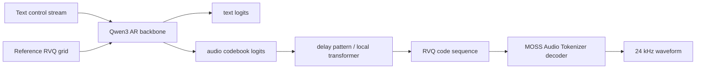

对 Delay 版本，理解它的关键是：

- prompt 是 `[T, 1 + NQ]` 的 unified rows。
- input embedding 是 text embedding 与多 codebook audio embedding 的相加。
- 输出是一个 text head 加 `NQ` 个 audio heads。
- audio code 先以 delay pattern 存成 `[T_delayed, NQ]`，再 de-delay 为 `[T_audio, NQ]`。
- codec 最终消费 `[NQ, B, T_audio]` 并输出 waveform。

对 Realtime 版本，理解它的关键是：

- outer Qwen3 每步提供 frame-level hidden。
- local transformer 在 frame 内生成 `rvq=16` 个 codebook。
- 每个 AR step 更接近“直接得到一个完整 audio frame”，因此更适合低首包延迟场景。
