# vLLM 与 vLLM-Omni 架构讲解

> 这篇文章先从 vLLM 的通用 LLM serving 框架开始，再过渡到 vLLM-Omni。vLLM-Omni 继承了 vLLM 的调度、worker、model runner、KV cache 等基础能力，并在其上加入 stage 化编排、跨 stage connector、diffusion engine 和多模态 pipeline 支持。

## 1. vLLM 整体架构

vLLM 的核心抽象可以按“入口层、EngineCoreClient、EngineCore、Scheduler、Executor、Worker、ModelRunner”来理解。入口层负责把用户请求转成 engine request；EngineCoreClient 是前台和引擎内核之间的通信适配层；EngineCore 执行持续调度循环；Scheduler 决定每一轮执行哪些 request/token；Executor 抽象执行后端；Worker 绑定具体 rank/device；ModelRunner 负责 GPU 上的模型 forward、采样、KV cache 读写。

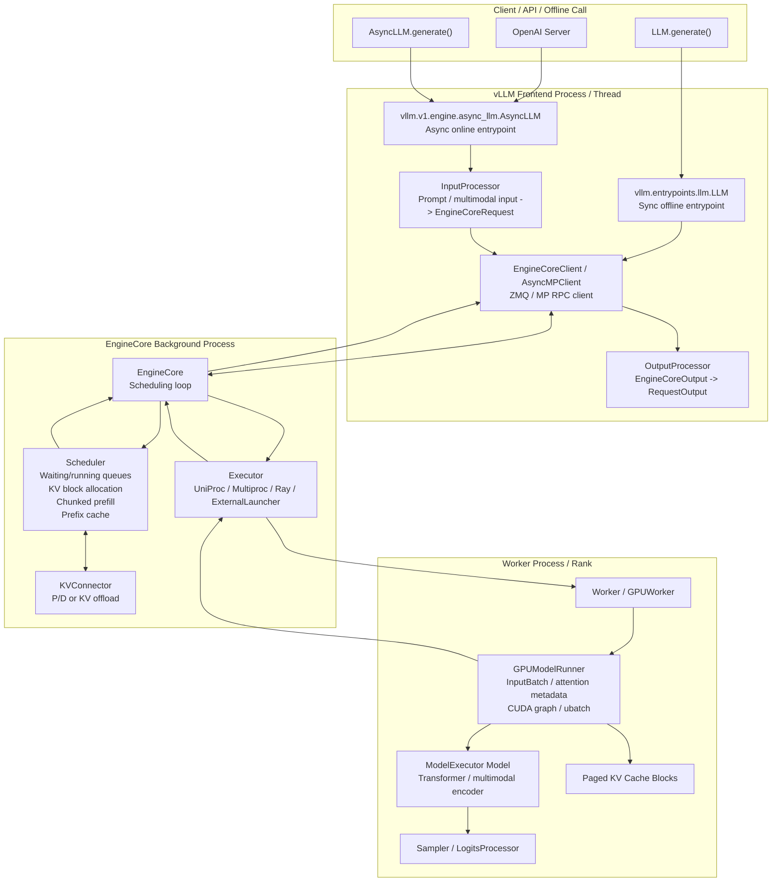

### vLLM 请求时序

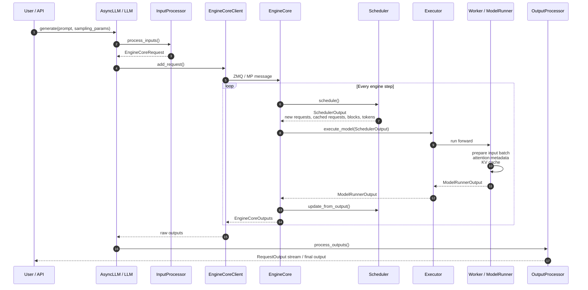

### vLLM 进程关系

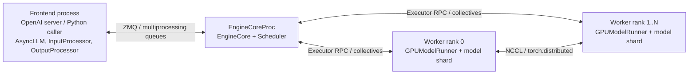

这个框架的基本形态是：一个 vLLM engine 管理一个模型执行图。Scheduler 持有 request 队列和 KV block 视角，ModelRunner 持有 GPU 上的 batch/forward 视角。

### 为什么要拆成这些层

这些类不是简单的“调用链包装”，而是在不同维度上隔离职责：API 生命周期、调度状态、分布式执行、rank-local 资源、GPU forward 逻辑分别由不同组件持有。

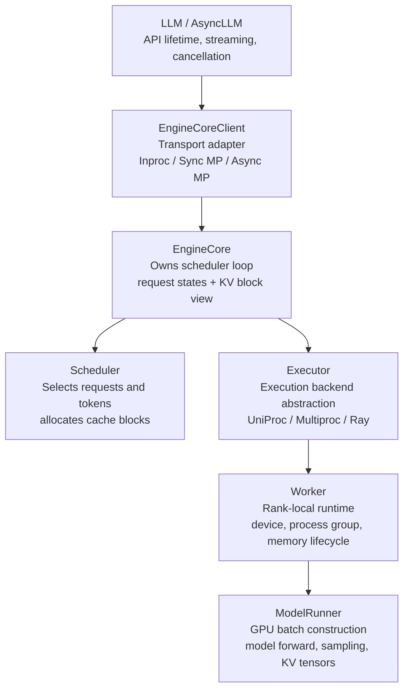

**EngineCoreClient 和 EngineCore 的边界**

EngineCoreClient 负责“怎么和引擎内核通信”。同一个 EngineCore 可以在当前进程里运行，也可以在后台进程里运行；前台可以是同步 `LLM`，也可以是基于 asyncio 的 `AsyncLLM`。因此 EngineCoreClient 提供 `InprocClient`、`SyncMPClient`、`AsyncMPClient` 等形态，把 ZMQ、multiprocessing queue、async future、输出轮询、abort、LoRA 管理、sleep/wakeup 等控制请求封装起来。

EngineCore 负责“引擎内核要维护什么状态”。它持有 scheduler、request 生命周期、KV cache 配置、prefix/cache 视角和每轮 engine step。这样前台 API server 的 event loop 不需要直接持有调度状态，也不会和后台调度循环耦合在一起。

**Executor、Worker、ModelRunner 的边界**

Executor 是执行后端抽象。EngineCore 只需要把 `SchedulerOutput` 交给 Executor，并从 Executor 收回 `ModelRunnerOutput`。至于这个执行发生在当前进程、多个本地子进程、Ray actor，还是外部 launcher 管理的 rank 上，EngineCore 不直接关心。

Worker 是 rank-local 的运行时对象。它知道自己的 `rank/local_rank`、device、distributed init method、NCCL/torch distributed 环境、CUDA allocator、sleep/wakeup、权重加载、KV cache tensor 初始化等资源生命周期。

ModelRunner 是模型执行对象。它不负责创建进程，也不负责分布式后端选择；它负责把 Scheduler 给出的本轮 request/token 变成 GPU input batch，构造 attention metadata，管理 CUDA graph/ubatch、multimodal encoder cache、KV cache tensor，并执行模型 forward 和采样。

### Executor 后端的差异

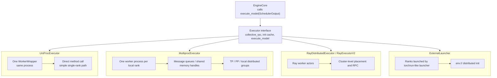

`UniProcExecutor` 是单进程路径，driver worker 在同一个进程里，`collective_rpc` 基本是直接方法调用，适合单 rank、调试或最小部署。`MultiprocExecutor` 会为本机每个 local rank 创建 worker 子进程，通过 message queue/shared memory 传递调度输入和模型输出，适合本机多 GPU、TP/PP 等并行形态。Ray executor 把 worker 放到 Ray actor 中，由 Ray 负责跨节点 placement 和 RPC。External launcher 面向 torchrun 这类外部启动器，rank 由外部进程组创建，vLLM 在每个 rank 内按确定性调度执行。

## 2. 从 vLLM 到 vLLM-Omni

vLLM-Omni 把“一个模型 engine”扩展成“多个 stage engine 组成的 DAG/流水线”。每个 stage 可以是 vLLM AR engine，也可以是 diffusion engine；每个 stage 有自己的 scheduler、worker、GPU 分配和 batching 策略；stage 之间通过 connector 传递 token、hidden state、codec chunk、KV cache 或 full payload。

### vLLM-Omni 总体类关系

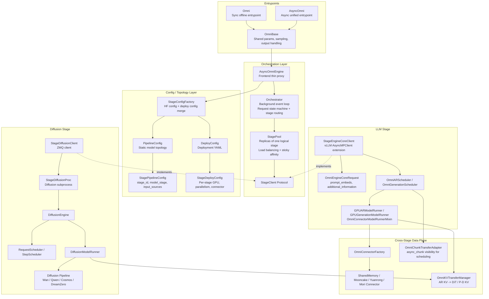

### vLLM-Omni 中的边界拆分

vLLM-Omni 复用了 vLLM 的 LLM engine，但外层不能只暴露一个 EngineCoreClient。原因是 any-to-any 模型往往不是单个 forward graph，而是一组异构 stage 的组合：有的 stage 是 AR token generator，有的 stage 是 codec decoder，有的 stage 是 diffusion denoiser，有的 stage 还需要从上游接收 KV cache 或 chunk payload。

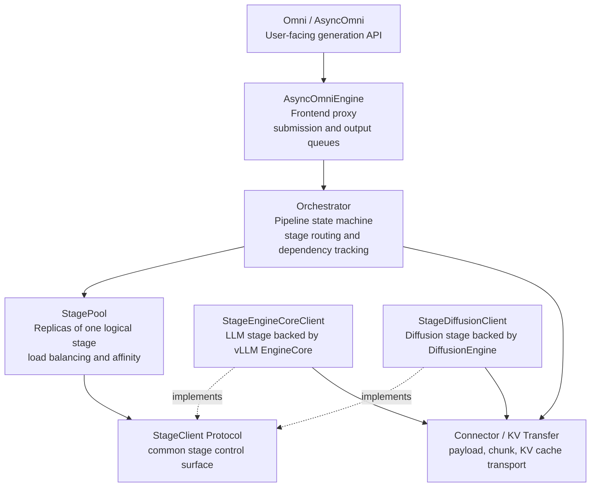

`AsyncOmniEngine` 仍然是前台 proxy。它的职责接近 vLLM 的 EngineCoreClient：接收请求、把请求提交给后台 event loop、把输出流返回给调用方。它不直接维护每个 stage 的依赖状态。

`Orchestrator` 是 pipeline 状态机。它知道一个 request 当前跑到哪个 stage、哪些上游输出已经 ready、哪些下游 stage 需要预提交、什么时候要构造 `submit_initial` 或 `submit_update`、什么时候把最终输出返回给前台。

`StagePool` 表示“一个 logical stage 的多个 replicas”。Orchestrator 不直接挑某个进程或 rank，而是把请求交给 StagePool；StagePool 根据 round-robin、least-queue 或 sticky affinity 选择 replica，并维护 request_id 到 replica 的绑定。

`StageClient` 是 stage 控制面的统一接口。LLM stage 由 `StageEngineCoreClient` 实现，内部复用 vLLM 的 EngineCore/Executor/Worker/ModelRunner；diffusion stage 由 `StageDiffusionClient` 实现，背后是 `StageDiffusionProc -> DiffusionEngine -> DiffusionModelRunner`。这样 Orchestrator 只需要面对统一的 stage API，而不需要把 AR token step 和 diffusion denoise step 写在同一个执行循环里。

### vLLM-Omni 进程关系

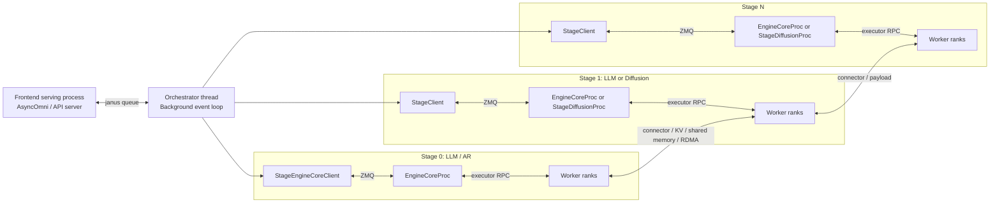

### 多 stage 编排怎么实现

多 stage 编排由四层共同实现：

1. **拓扑层**：`PipelineConfig` 定义固定 stage 图，例如 Qwen3-Omni 是 `thinker -> talker -> code2wav`，HunyuanImage3 是 `AR -> DiT`。`StagePipelineConfig` 描述每个 stage 的 `execution_type`、`input_sources`、`final_output_type`、自定义输入转换函数和 async chunk 函数。
2. **部署层**：`DeployConfig`/`StageDeployConfig` 读取每个 stage 的 GPU、TP/DP、max_num_seqs、connector、cache、diffusion parallel 等参数。拓扑固定，部署参数可调。
3. **控制面**：`AsyncOmniEngine` 启动后台 `Orchestrator`，并初始化每个 stage 的 `StagePool`。`StagePool` 管理 replicas，负责 round-robin、least-queue 或 sticky affinity。
4. **数据面**：LLM stage 通过 `OmniConnectorModelRunnerMixin` 和 connector 后台线程传输 chunk/full payload/KV；diffusion stage 通过 `StageDiffusionClient -> StageDiffusionProc -> DiffusionEngine` 接收请求，必要时从 AR stage 接收 KV cache。

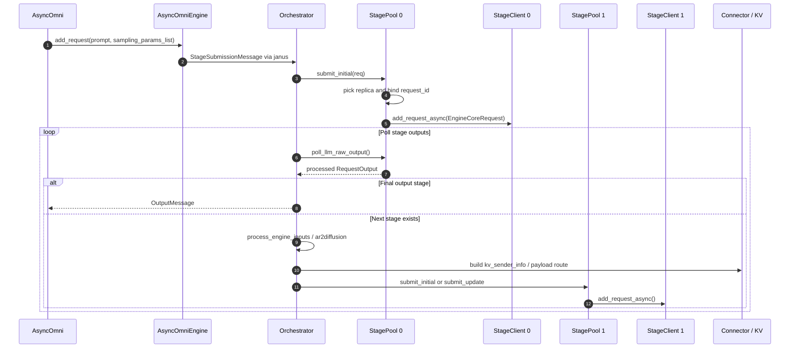

普通模式通常等上游 stage `finished=True` 后再构造下游请求。`async_chunk=true` 时，Orchestrator 会先把下游 stage 预提交起来，随后上游 ModelRunner 把 chunk 写入 connector，下游 scheduler/runner 从 connector 接收 chunk 并继续执行。

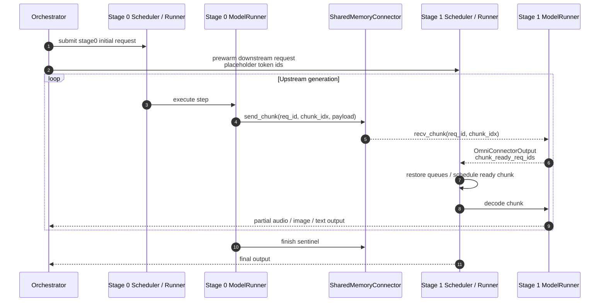

这种编排带来几个系统层面的变化：

- **异构 stage 独立 batching**：talker 和 code2wav 可以各自设置 `max_num_seqs/max_num_batched_tokens`，diffusion stage 可以按 shape/sampling key 做 request-level 或 step-level batching。
- **流水线 overlap**：下游不用等上游完整结束，尤其适合 TTS 的 codec chunk 到 waveform。
- **资源隔离**：AR、DiT、VAE、codec decoder 可以分配到不同 GPU 或不同 replica。
- **复用 vLLM 的 LLM 执行能力**：LLM stage 仍然使用 vLLM 的 KV cache、scheduler、worker、CUDA graph、TP/DP。
- **数据面可替换**：同一 stage 拓扑可以换 SharedMemory、RDMA/Mooncake、Yuanrong 等 connector。

## 3. 语音模型：Qwen3-Omni / Qwen3-TTS

这类模型的框架模式基本一致：上游 AR 模型产生文本、hidden state 或 RVQ/codec token；下游 generation/code2wav stage 把 codec token 解码成音频。重点不是某个模型内部结构，而是 stage 间如何流式串起来。

### Qwen3-Omni stage 图

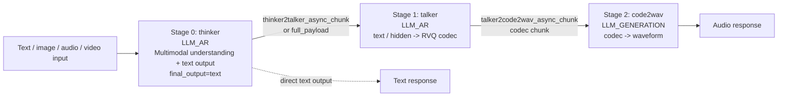

Qwen3-Omni 可以看成三段 pipeline：

- stage 0 `thinker`：`LLM_AR`，处理 multimodal input，输出 text/latent。
- stage 1 `talker`：`LLM_AR`，消费 stage 0 输出，生成 RVQ codec latent。
- stage 2 `code2wav`：`LLM_GENERATION`，消费 stage 1 的 codec chunk，输出 audio。

### Qwen3-TTS stage 图

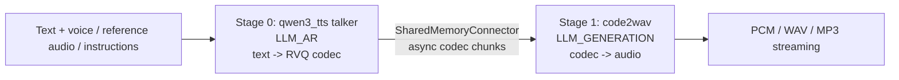

Qwen3-TTS 是两段 pipeline：talker 生成 codec token，code2wav 把 codec token 解码成音频。`async_chunk` 模式下，stage 1 可以先以 placeholder request 进入调度队列，真正的 codec payload 由 connector 持续传入。`codec_chunk_frames`、`codec_left_context_frames`、`initial_codec_chunk_frames` 等参数控制首包延迟、滑动上下文和音频连续性。

### 语音 async chunk 的框架路径

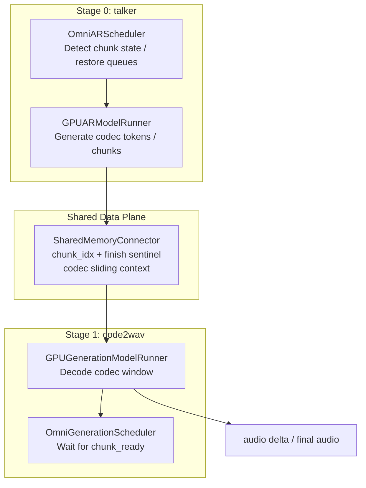

这个设计把“流式”从业务层下沉到 scheduler/model runner/connector：

- 上游每产生一段 codec，就可以通过 connector 发给下游。
- 下游 stage 可以在自己的 scheduler 中把多个请求的 chunk 合批。
- `initial_codec_chunk_frames` 控制首段解码窗口，后续恢复常规 chunk 窗口，减少过小窗口造成的音质和边界问题。
- request 完成和 abort 会释放 stage binding 和 connector 状态，避免下游残留孤立请求。

## 4. AR + DiT 模型：Hunyuan-Image3.0

Hunyuan-Image3.0 代表一种 AR+DiT 混合结构：先用 AR 模型生成面向图像扩散的中间表示、文本序列或 latent 上下文，再用 DiT 执行 denoise，最后 VAE decode 成图像。

### 模型结构示意

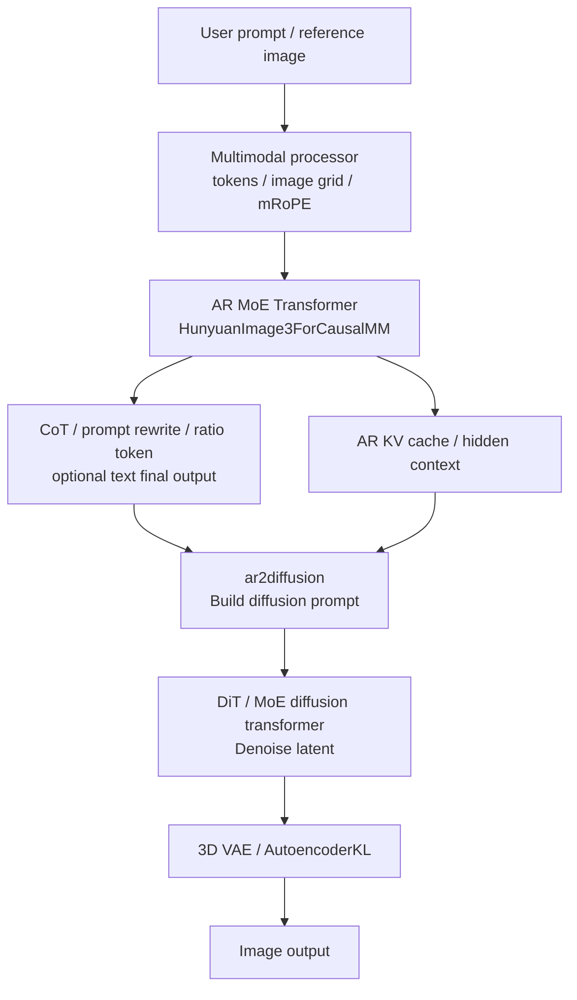

### vLLM-Omni 如何支持

```mermaid
flowchart LR
    subgraph Stage0["Stage 0: AR"]
        S0["StageEngineCoreClient"]
        ARSched["OmniARScheduler"]
        ARRunner["GPUARModelRunner"]
    end

    subgraph Transfer["AR -> DiT Transfer"]
        Cfg["omni_kv_config.need_send_cache"]
        Conn["Mooncake / Yuanrong / SharedMemory Connector"]
        KVInfo["kv_sender_info"]
    end

    subgraph Stage1["Stage 1: DiT"]
        S1["StageDiffusionClient"]
        Proc["StageDiffusionProc"]
        DE["DiffusionEngine"]
        DR["DiffusionModelRunner"]
        HY["HunyuanImage3 diffusion pipeline"]
    end

    S0 --> ARSched --> ARRunner --> Cfg --> Conn --> KVInfo
    KVInfo --> S1 --> Proc --> DE --> DR --> HY
```

在这个 pipeline 中，stage 0 是 AR，负责文本或 latent 上下文生成，并可发送 KV cache；stage 1 是 diffusion，接收 AR 侧的上下文和 KV 信息后执行 denoise。部署层可以对两个 stage 分别设置 GPU、并行策略、connector、cache/offload 和 inflight 限制。

这种分解使 AR 和 DiT 可以独立扩缩容：AR stage 继续使用 vLLM 的 paged KV 与 token scheduler，DiT stage 使用 diffusion 的 executor、parallel_config、cache/offload。

## 5. 纯 diffusion pipeline：以 Wan2.2 为例

纯 diffusion 模型通常没有上游 AR stage，入口就是一个 diffusion stage。vLLM-Omni 在这里提供统一 serving API、diffusion scheduler、worker/model runner、并行策略和可选动态 batching。

### Wan2.2 模型结构

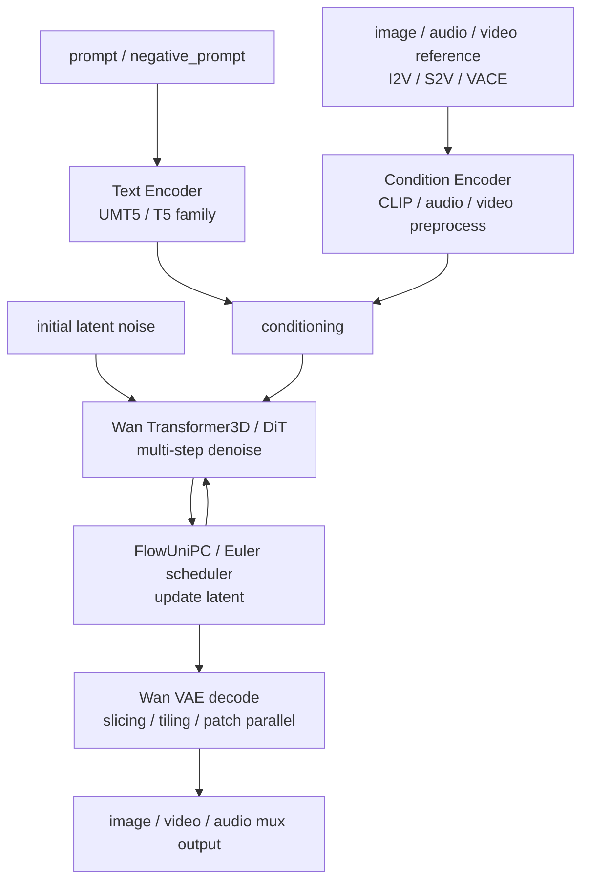

### diffusion engine 框架图

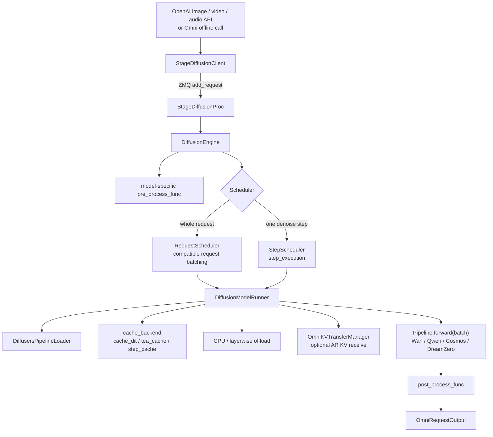

### CFG parallel、USP、Ring、VAE parallel

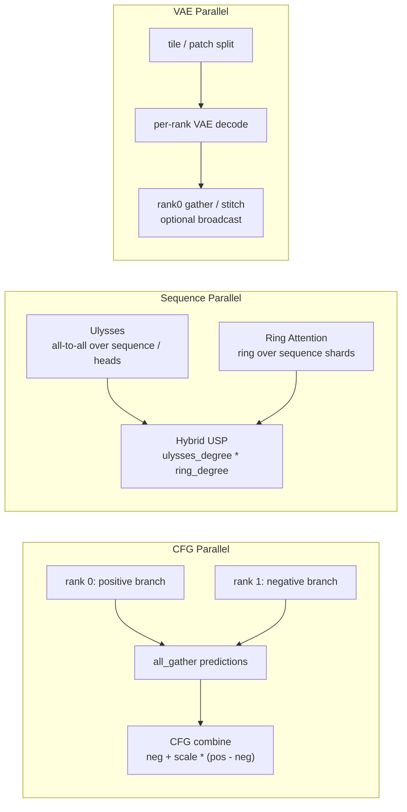

Wan2.2 常见 8 卡部署形态：

- distilled/no CFG：`--usp 8 --vae-patch-parallel-size 8`。
- official/需要 CFG：`--cfg-parallel-size 2 --usp 4 --vae-patch-parallel-size 8`，总并行度约等于 `cfg * usp = 8`。
- `--use-hsdp` 用于 DiT 权重内存效率。
- `--vae-use-tiling` 与 VAE patch parallel 降低 decode 峰值并提升大分辨率吞吐。

### diffusion 动态 batching：Qwen-Image

Qwen-Image 的 recipe 体现了 diffusion 动态 batching 的轻量框架：

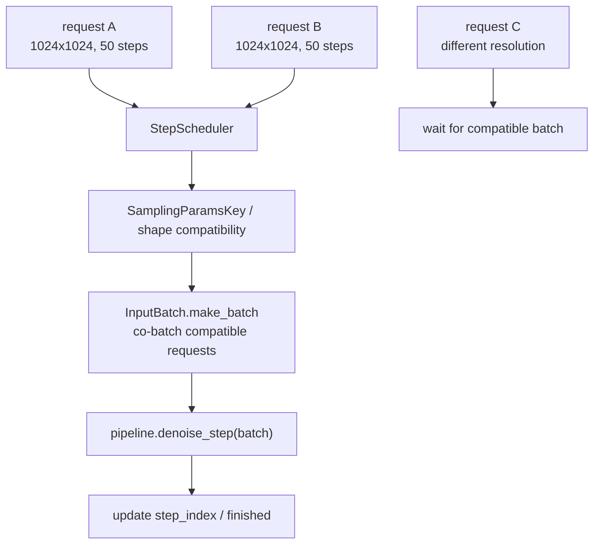

当前约束是 shape-sensitive：相同或兼容形状、采样参数的请求可以 co-batch；不同分辨率通常不会进入同一个 batch。

## 6. 实验性全双工

experimental full-duplex 是模型无关的 full-duplex 框架雏形，不是主 HTTP orchestrator 的替代实现。核心思路是把实时输入、响应流和打断拆成 session/runtime/adapter 三层。

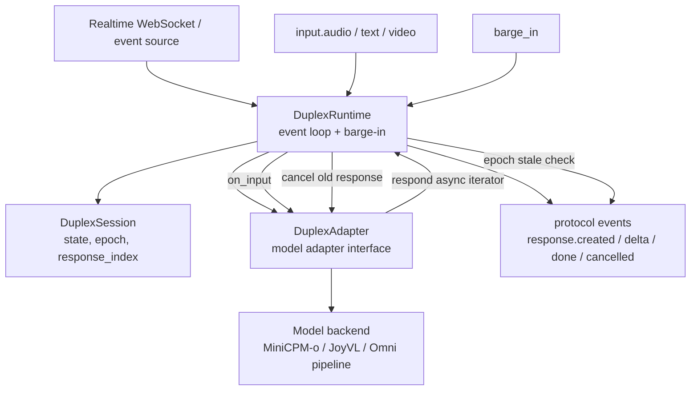

未来接入真正全双工语音时，可以沿用这个分层：

- `DuplexSession` 管 session 级记忆、播放 ACK、epoch。
- `DuplexRuntime` 保证输入事件不会被正在输出的长响应阻塞。
- `DuplexAdapter` 对接具体 vLLM-Omni pipeline，可以把 `input.audio.chunk` 转成 streaming update，把输出 audio delta 推回 WebSocket。
- barge-in 通过 epoch 使旧输出失效，并向下游 engine 发 abort/cancel。

## 7. 世界模型：Cosmos3 与 DreamZero

### Cosmos3

Cosmos3 在 vLLM-Omni 中是单 diffusion pipeline，但任务形态更丰富：T2I、T2V、I2V、V2V、transfer control、video+sound、action policy/inverse dynamics。

```mermaid
flowchart TB
    Prompt["structured prompt / text"] --> TextTok["tokenizer / text conditioning"]
    RefImg["image / video reference"] --> VisionCond["vision latent conditioning"]
    Control["edge / depth / seg / blur / wsm control"] --> Transfer["transfer control branch"]
    Action["robot observation / action"] --> ActionBranch["action / state tokens"]
    Sound["generate_sound"] --> SoundBranch["sound latent branch"]

    TextTok --> Cosmos["Cosmos3 VFM Transformer"]
    VisionCond --> Cosmos
    Transfer --> Cosmos
    ActionBranch --> Cosmos
    SoundBranch --> Cosmos
    Cosmos --> VAE["video VAE decode"]
    Cosmos --> Audio["sound tokenizer / decode"]
    Cosmos --> ActOut["action trajectory"]
```

框架上它仍走 `DiffusionEngine -> DiffusionModelRunner -> Cosmos3OmniDiffusersPipeline`，只是 pipeline 内部根据 request 的 modalities/extra_params 选择 T2I/T2V/I2V/V2V/Action/Sound 分支。CFG parallel 对多输出/多分支场景由 pipeline override `predict_noise/combine_cfg_noise` 处理。

### DreamZero

DreamZero 是 robot/world-model 方向：输入 robot observation、图像、文本指令和历史状态，输出未来视频/action。当前形态是单 diffusion stage，pipeline 内部有 persistent state 和 KV cache。

```mermaid
flowchart TB
    Obs["robot_obs<br/>external cameras / wrist / state"] --> Transform["embodiment transform<br/>DROID / RoboArena"]
    Transform --> ImgEnc["DreamZero image encoder"]
    Prompt["instruction / negative prompt"] --> TextEnc["UMT5 text encoder"]
    Prev["DreamZeroState<br/>frame buffer + KV cache"] --> CausalWan["CausalWanModel<br/>causal DiT + action / state tokens"]
    ImgEnc --> CausalWan
    TextEnc --> CausalWan
    CausalWan --> Scheduler["FlowUniPC scheduler"]
    Scheduler --> VideoLatent["future video latents"]
    Scheduler --> ActionLatent["action latents"]
    VideoLatent --> VAE["Wan VAE decode"]
    ActionLatent --> ActionDec["action decoder / denorm"]
```

`DreamZeroState` 管理 session 内的 frame buffer、KV cache 和 reset；`CausalWanModel` 是带 causal attention/KV cache/action-state token 的 DiT 变体。当前部署形态还可以启用 `step_cache`，用于跳过相似 denoise step。

关于未来的 DreamZero KV cache 支持：PR `https://github.com/vllm-project/vllm-omni/pull/4364` 可以作为方向参考，但这里不把它当成已经完善的接口。更稳妥的 high-level 目标是：

- 把 DreamZero pipeline 内部的 KV cache 生命周期暴露给 vLLM-Omni 的 diffusion runner/state 管理。
- 明确 session_id、local attention roll、KV reset、frame buffer reset 之间的边界。
- 避免只在模型私有对象里增长 cache，导致跨 replica、abort、sleep/wakeup、batch/step cache 场景不可控。
- 长期最好能复用 vLLM/Omni 的 paged KV 或 connector 语义，而不是每个 world model 单独维护一套不可调度的 KV。

## 8. 讲解顺序

```mermaid
flowchart LR
    A["vLLM single-engine architecture<br/>LLM / AsyncLLM -> EngineCore -> Scheduler -> Worker"] -->
    B["Why vLLM-Omni introduces stages<br/>any-to-any models need more than one forward graph"] -->
    C["Class relationships<br/>Omni / AsyncOmni / AsyncOmniEngine / Orchestrator / StagePool"] -->
    D["Multi-stage orchestration<br/>topology + deployment + control plane + data plane"] -->
    E["Speech models<br/>Qwen3-Omni / Qwen3-TTS async chunk"] -->
    F["AR + DiT<br/>HunyuanImage3 AR-to-DiT KV reuse"] -->
    G["Pure diffusion<br/>Wan2.2 parallelism + Qwen-Image dynamic batching"] -->
    H["Experimental directions<br/>full-duplex + world models"]
```
